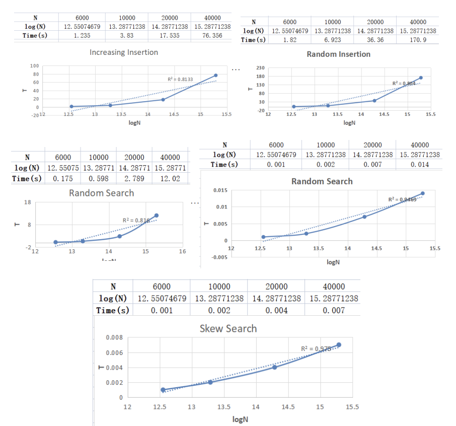
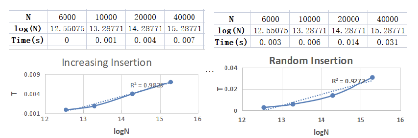
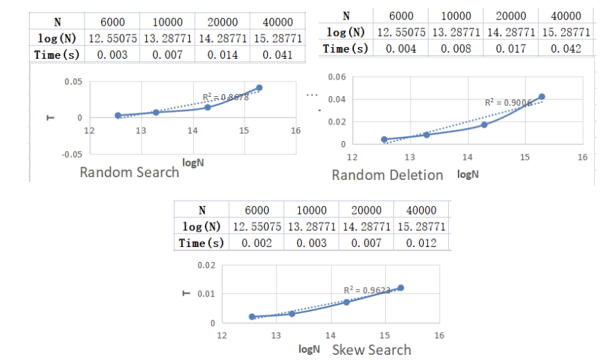
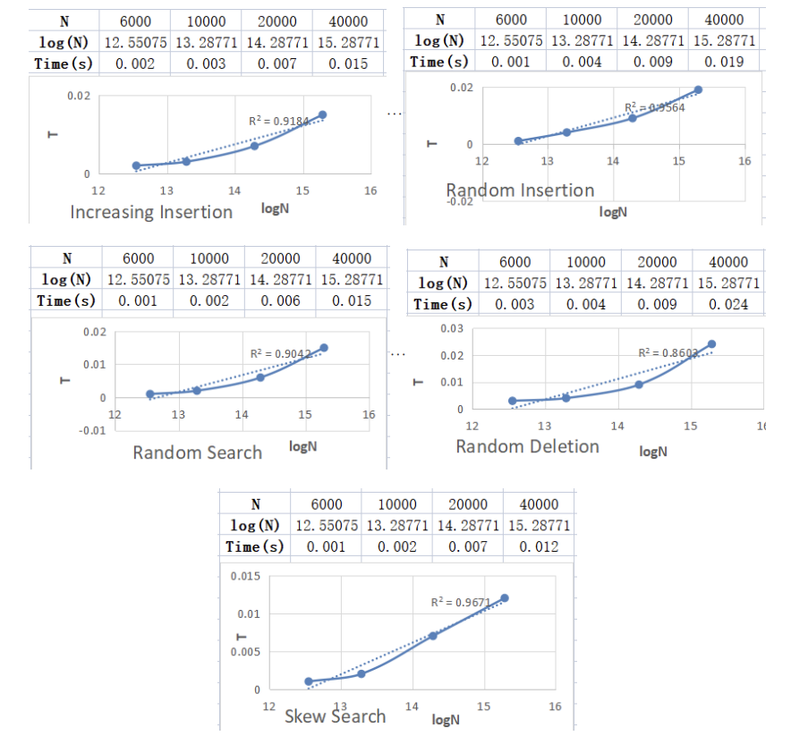

## Abstract

We implemented AVL tree, Splay tree, and Red-Black tree according to the methods taught in the class. Compare the time they consume by inserting and deleting random and sequential data, and analyze their performance by plotting and deducing. At the same time, the theoretical performance is analyzed, compared, and optimized is tried.

## 1. Introduction

In this project, we implement AVL tree, splay tree and Red-Black tree, and compares three classic data structure. The aspects that are tested are as follow. 

- insertion of N elements in increasing order.
-  insertion of N elements in random order. 
- random deletion of all the N elements from a tree that is built by random insertion. 
- N random queries in a tree that is built by random insertion. 
- N skewed queries in a tree that is built by random insertion. By skewed, we mean that only a small fraction of the elements are frequently quired.

## 2. Implement Ideas and Theoretical Performance

### 2.1 AVL Tree

#### 2.1.1 Data Structure

The core of the AVL tree is balance. After each insertion and deletion of a node, the height of the ancestor nodes of the corresponding position node needs to be updated, and a rotation needs to be made in the case of imbalance. Therefore, we need each node to store the height and a pointer to the child's node in addition to its own value.

```c
typedef struct node *ptr;
struct node{
    int element;
    ptr left;
    ptr right;
    int height;
};
typedef struct node *Tree;
```

#### 2.1.2 Pseudocode

**Update**

```pascal
Procedure Update(Tree T):
if !T then:
	return 0
else
	return T->height=maxheight(T->left,T->right)
if T is unbalanced then:
	Rotate(T,case(T))
```

Return the height from the bottom up to update, if the height of the left and right subtrees is unbalanced, determine the imbalance type, rotate separately, and then update the height again.

**Insertion**

```pascal
Procedure Insertion(Tree T,int item):
if !T then
	new=create(item)
else
	if item > T->element then
		Insertion(T->right,item)
	else
		Insertion(T->left,item)
update(root)
```

For the insert function, if the node is empty, a new node is created, assigned as the input value, and the new node address is returned. Otherwise, the input value is compared to the node value size, and the input value is inserted into the left or right subtree of the node according to the search tree rules.

**Deletion**

```pascal
Precedure Deletion(Tree T,int item):
if item < T->element then
	Deletion(T->left,item)
else if item > T->element then
	Deletion(T->right,item)
else
	if T does not have child then
		free(T)
	else if T has one child then
    	T<-T.child
    else
    	T->element<-min(T->right)
    	Deletion(T->right,min(T->right))
update(root)
```

To delete a node, you need to find the corresponding node first. They are then treated separately according to the number of children. No children, delete directly. One child, replace with child. Two children, replaced with the smallest node of the right subtree.

#### 2.1.3 Theoretical Performance

We know that the height of the AVL tree is no more than $O(\log{N})$. So the complexity of finding a node is $O(\log{N})$. Then the complexity of creating the node is $O(1)$, So the complexity of inserting a node is $O(\log{N})$. Deleting one node is equivalent to looking for two nodes and deleting them once, so the complexity is $O(\log{N})$, else. As for the update operation, the maximum number of rotation relates to height, which is $O(\log{N})$.

All in all, the complexity of various operations in an AVL tree is the same, all of them are $O(\log{N})$.

### 2.2 Splay Tree

#### 2.2.1 Data Structure

Splay trees don't care about highly logged, the focus is on Splay, so you need to remember the address of the parent. So compared to the AVL tree, the node data structure has undergone some changes.

```c
typedef struct node *ptr;
struct node{//the structure of nodes in a tree 
    int element;
    ptr left;
    ptr right;
    ptr parent;
};
typedef struct node *Tree;
```

#### 2.2.2 Pseudocode

**Search**

```pascal
Procedure Search(Tree T,int item):
do idx=BST_Search(T,item) then
splay(T,idx)
```

In order to search for a node, first find the location as you would in a BST search, and then Splay the node to the root.

**Insertion**

```pascal
Procedure Insertion(Tree T,int item):
do idx=BST_Insertion(T,item) then
splay(T,idx)
```

The insert operation is also an addition of an Splay operation to the insertion of the BST.

**Deletion**

```pascal
Procedure Deletion(int item):
do Search(root,item) then
if root does not have child then
	delete it
	root=Null
else if root has one child then:
	root=root->chile
	delete root->parent
else 
	idx=Find_Max_Item(root->left)
	Splay(root->left,idx)
	root->left->right=root->right
	root=root->left
	delete root->parent
```

Deletion requires a Play, and then distinguishes between the number of children in the root node. No children, delete directly. One child, replace with child. Two children, Splay the largest node of the left subtree to the top of the left subtree, connect the right subtree to the left subtree, and replace the root with the left subtree.

#### 2.2.3 Theoretical Performance

Splay may have a serious imbalance that causes some of the search operations to reach a serious level of complexity of $O(N)$. But each time such an operation adjusts the situation of the entire tree, it will bring optimization to other operations. Taking $\Phi(T)=c\Sigma{\log{(size(u))}}$ as a potential function, it can be derived from the amortized analysis that the complexity of operations is $O(\log(N))$

### 2.3 Red-Black Tree

#### 2.3.1 Data Structure

For red-black trees, in addition to the most basic data storage and left and right subtree pointers, we also need to store some additional information in the tree nodes. The first is the color of the tree. I use the boolean value to store the color of the tree for easy judgment, and the macro is defined as red and black for easy coding. In addition, considering the rotation operation of the four-generation node of the red-black tree, I stored its parent node pointer and the information of whether it is the left or right son in the red-black tree node, which is convenient for insertion and deletion operations.

```c
#define red true
#define black false

#define RBT_Left_Child 1
#define RBT_Right_Child 2
#define RBT_Is_Root 3
#define To_Define 4
#define N 10000

struct Red_Black_Tree_Node;

typedef struct Red_Black_Tree_Node RBTree;
typedef RBTree* rbt;

struct Red_Black_Tree_Node
{
	int data;
	rbt left;
	rbt right;
	rbt father;
	bool color;
	int position;
};
```

#### 2.3.2 Pseudocode

The operation of a red-black tree is essentially an implementation of the 2-3-4 tree conceptual model. We don't need to memorize the way the algorithm is written, but to understand the operation of the red-black tree through a conceptual model. The operations shown in the following articles are based on the specific operations of the red-black tree based on the convenience of writing code.

**Insertion**

```pascal
Procedure Insertion(Tree T):
if T is root then:
	T->color = black
	return root
else if father is black
	return root
else if T->father is red and uncle is red then:
	father->color = black
	unlce->color = black
	grandfather->color =red
	return Insertion(grandfather)
else if father is red and uncle is black then:
	if father is left and T is left then:
		exchage_color(grandfather,father)
		right_rotation(grandfather)
		return root
	else if father is left and T is right then:
		left_rotation(father)
		return Insertion(father)
	else if father is right and T is right then:
		exchage_color(grandfather,father)
		right_rotation(grandfather)
		return root
	else if father is right and T is left then:
		left_rotation(father)
		return Insertion(father)
```

Newly inserted nodes are all red. 

4 cases of red-black tree insertion:

1. When the new node is located at the root node and has no parent node, the processing idea: just set the node to black directly. 

2. When the parent node of the new node is already black, the processing idea: don't move, this is already a red-black tree. 

3. When the parent node and uncle node are both red, processing ideas: a. Set the parent node and uncle node to black; b. Set the grandfather node to red; c. Set the grandfather node to the current node, and continue to New current node to operate.

4. When the parent node is red and the uncle node is black, there are four cases as follows:  

   i)The current node is the left child of the father, and the father is the left child of the grandfather (Left-Left). Processing ideas: a. Rotate the grandfather node to the right; b. Exchange the colors of the parent node and the grandfather node.  

   ii)The current node is the father's right child, and the father is the grandfather's left child (Right-Left). Processing ideas: a. Rotate the parent node to the left, and use the parent node as the current node; b. Then use the Left Left case.  

   iii)The current node is the right child of the father, and the father is the right child of the grandfather (RightRight). Processing ideas: a. Rotate the grandfather node to the left; b. Exchange the colors of the parent node and the grandfather node. 

   iv)The current node is the father's left child, and the father is the grandfather's right child (Left-Right). Processing ideas: a. Rotate the parent node to the right and use the parent node as the current node; b. Then use the Right Right case.

**Deletion**

```pascal
Precedure Deletion(Tree T):
	if T has no child then：
		if T is red
			free(T)
			return root
		else
			Deletion_Fix(T)
			return root
	if T has one child then:
		exchage_data(T, child)
		return Deletion(T)
	if T has two child then:
	 	exchange_data(T, find_small(right_subtree))
	 	return Deletion(small)
```

Delete node X from the tree (delete by looking for successor nodes) 

1.  If X has no children, and if X is red, delete X directly; if X is black, rotate and colorize with X as the current node, and finally delete X .
2.  If X has only one child C, exchange the values of X and C, and then delete the new X. According to the red-black tree properties, X cannot be red at this time, because the red node either has no children or has two black children. At this time, the new X is used as the current node to judge the case 1.
3. If X has two children, find the smallest node D from the successor, exchange the values of X and D, and then delete the new X. At this time, the new X is used as the current node to judge the case1 or 2.

**Deletion_Fix**

```pascal
Precedure Deletion_Fix(Tree T):
	if T is root or T is red then:
		T->color = black
		return root
	else if T is black then:
		if brother is red then:
			brother->color = black
			father->color = red
			rotation(father)
			return Deletion_Fix(T)
		if brother is black and far_nephew is black and near_nephew is black
			brother->color = red
			return Deletion_Fix(father)
		if brother is black and far_nephew is black and near_nephew is red
			exchange_color(T,near_nephew)
			rotation(brother)
			return Deletion_Fix(T)
		if brother is black and far_nephew is red
			brother->color = father->color
			father->color = black
			far_nephew->color = black
			rotation(father)
			return root
```

N=The current node

P=N's father

W=N's brother

Nf=N's far nephew

Nn=N's near nephew

1. N is the root or N is red, then: directly set N to black.
2. N is not the root and N is black, and W is red, then: set W to black, P to red, and rotate P (when N is the left child of P, rotate left, and N is the right child of P right-hand rotation), turn the situation into situations 1, 2, 3, 4, 5.
3.  N is not the root and N is black, and W is black, and the left and right children of W are all black, then: set W as red, set P as the current node to rotate and color, and convert the situation to case 1 , 2, 3, 4, 5.
4. N is not a root and N is black, and W is black, and Nf is black, and Nn is red, then: swap the colors of W and Nn, and rotate W (N is the left child of P, right-rotate, N is the right child of P for left rotation), after the rotation, the new brother W of N has a red WR, then it is converted to case 5.
5. N is not a root and N is black, and W is black, and Nf is red, and Nn is black, then: set W to the color of P, P and Nf to black, and rotate P (N is The left child of P is left-handed, N is the right child of P is right-handed), and N is set to the root.

#### 2.3.3 Theoretical Performance

We know that the height of the red-black tree is no more than $O(\log{N})$. So the complexity of finding a node is $O(\log{N})$. Then the complexity of creating the node is $O(1)$, So the complexity of inserting a node is $O(\log{N})$. Deleting one node is equivalent to looking for two nodes and deleting them once, so the complexity is $O(\log{N})$.

All in all, the complexity of various operations in a red-black tree is the same, all of them are $O(\log{N})$.

## 3. Testing Results and Analysis

Random insertion with *.txt, search with *_1.txt, deletion with *_2.txt.

### 3.1 AVL Tree



These results are right.The worst complexity search, insert and delete are $ O (logn)$

### 3.2 Splay Tree





These results are right.Average complexity is $O(logn)$.

### 3.3 Red-Black Tree



These results are right.The complexity of all insert, delete and find operations is $O (logn)$.

## 4. Conclusion and Comment

### 4.1 AVL Tree 

**Advantage**: 

The worst complexity search, insert and delete are $O (logn)$.It is simple to implementate and operate.

**Disadvantage**: 

There is a gap between the measured complexity and the theoretical complexity. The cost of rotation after insertion and deletion is expensive. After the delete operation, rotate up to $O(logn) $ times. 

### 4.2 Splay Tree

**Advantage**: 

There is no need to record the node height and balance factor, and the programming is simple .Average complexity is $O (logn)$. 

**Disadvantage**: 

Complexity analysis is complex and efficiency is not guaranteed in the worst case. 

### 4.3 Red-Black Tree

**Advantage**: 

The complexity of all insert, delete and find operations is $O (logn)$.The insertion operation can reach the balance state after up to 2 rotations, while the deletion operation can reach the balance state after one rotation. The deletion operation may lead to recursive double black correction, but before rotation, it is only dyed without any substantial change in the structure of the tree, so the speed is better than that of AVL tree. 

The red black tree can ensure that in the rebalancing process after each insertion or deletion operation, the update of the whole book topology only involves constant nodes. Although it is necessary to re dye $O (logn)$ nodes in the worst case, it is only in terms of allocation. 

**Disadvantage**: 

The height difference between the left and right subtrees is larger than that of AVL trees. 

### 4.4 Summary 

AVL Tree is a strictly balanced tree, so when adding or deleting nodes, according to different situations, the number of rotations is more than that of red black tree. The AVL tree will take a little more time to insert and delete. 

The red black tree is weakly balanced. The non strict balance is used to reduce the number of rotations when adding and deleting nodes.Both belong to self balanced binary tree, so reducing the depth of the tree will naturally improve the search efficiency. 

The time complexity of searching, inserting and deleting is the same $O (logn)$.

## 5. Source Code

[Github Repository](https://github.com/jwimd/Comparing_Different_Binary_Search_Trees)
