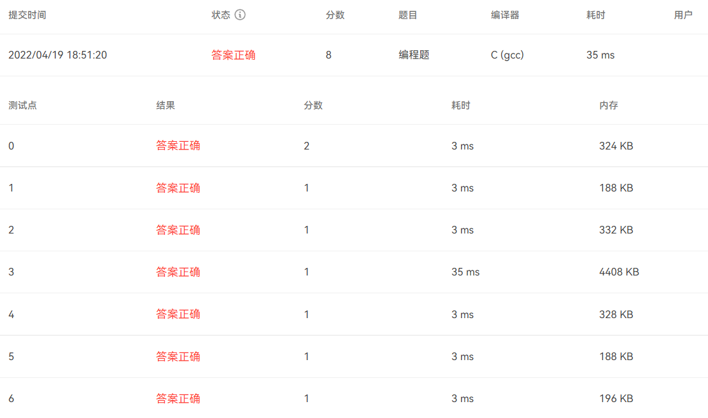
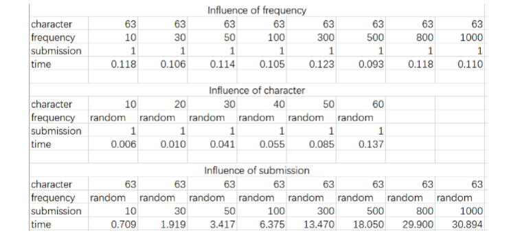
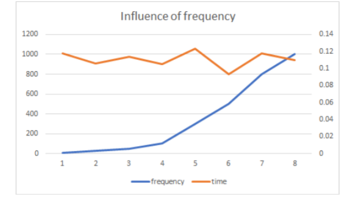
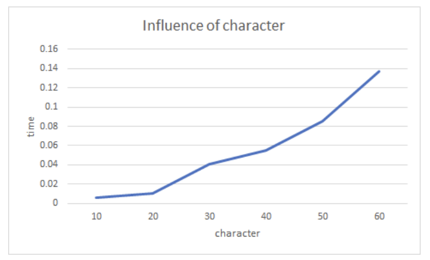
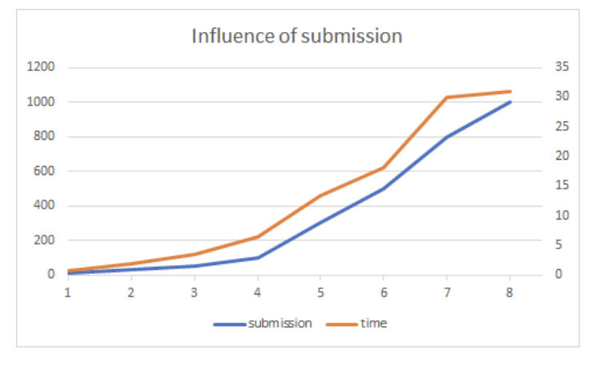

## 1. Introduction

We need to judge the correctness of Hoffman's code. Hoffman encoding refers to the indefinite length of each character based on its number of occurrences, and the requirement of encoding is that each encoding does not become a prefix for another encoding. The way Hoffman codes is not unique, we get the number of times each character appears and several sets of encodings, and we need to judge whether each encoding is correct or not. 

## 2. Implement Ideas and Theoretical Performance

### 2.1 Data Structure

```c
typedef struct HFNode *HFTree;
struct HFNode{//the data structure to record frequency
    char letter;
    int fre;
    int LChild;
    int RChile;
    int Parent;
};
```

We need to store each character and the number of occurrences it corresponds to. At the same time, considering that a tree needs to be built, it is also necessary to store the location of its children and parent. Because we intend to take an array to store information for each character, the storage of the parent node child node can take the same way that the subscript is stored.

```c
typedef struct Encode *codes;
struct Encode{
    char letter;
    char code[64];
};
```

We also need to store each character and its corresponding encoding, so we also build a struct.

### 2.2 Algorithm

#### 2.2.1 Creation of Tree

The tree is relatively simple to build, you only need to find two nodes with the smallest number of occurrences in the node without a parent node and merge them.

#### 2.2.2 Check

There are two points we need to judge, whether the length of the code matches, and the total length statistics are unique. If the length does not match, it can be directly judged as an error.

Also, you need to determine whether each encoding is a prefix for another. Considering that the earlier the encoding, the longer, therefore, check whether the subsequent encoding is a prefix of the preceding encoding, and once it is found that it is not a prefix, the result is directly obtained. A normal end to the loop indicates a prefix relationship and an incorrect encoding.

## 3. Testing Results and Analysis

### 3.1 PAT



### 3.2  Analysis



#### 3.2.1 Influence of Frequency

When character = 63 and submission=1. 



#### 3.2.2 Influence of Character

When frequency is random and submission=1.



#### 3.2.3 Influence of Submission

When frequency is random and character = 63.



## 4. Conclusion and Comment

### 4.1 Theoretical analysis

For the construction of the tree, it is necessary to traverse two rounds each time to find two minimum occurrences, and the total number of rounds required is $N$, so the complexity is $O(N^2)$.

The part that determines whether it is correct only needs to consider the prefix judgment part, which can be easily seen that the complexity is $O(N^2)$.

Therefore, the total complexity is also $O(N^2)$.

### 4.2 Improve ideas

The complexity of the tree construction process can be reduced by means of sorting and double queuing, and it can be optimized to $O(NlogN)$.

