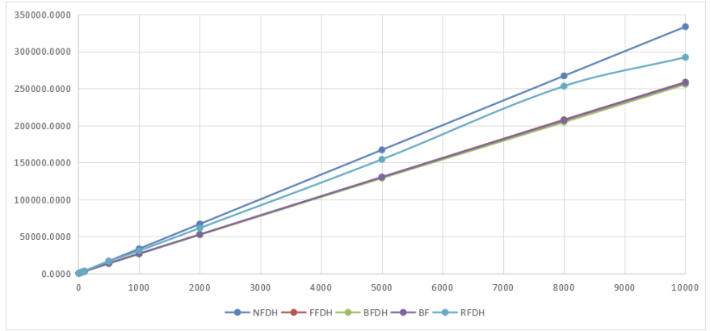
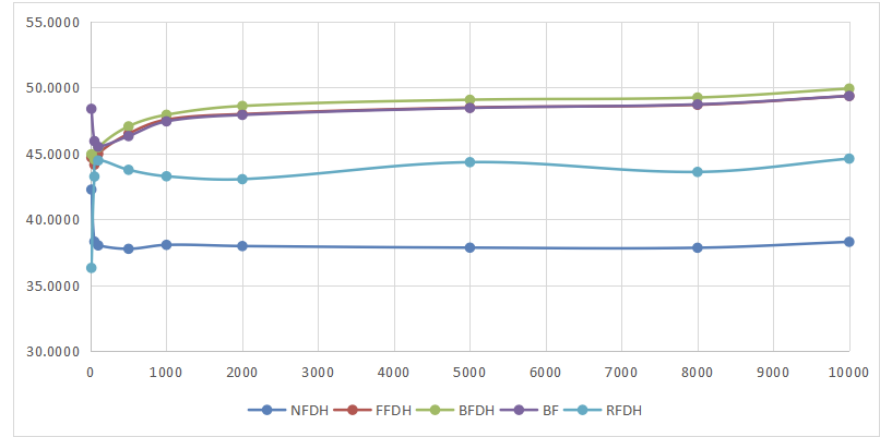
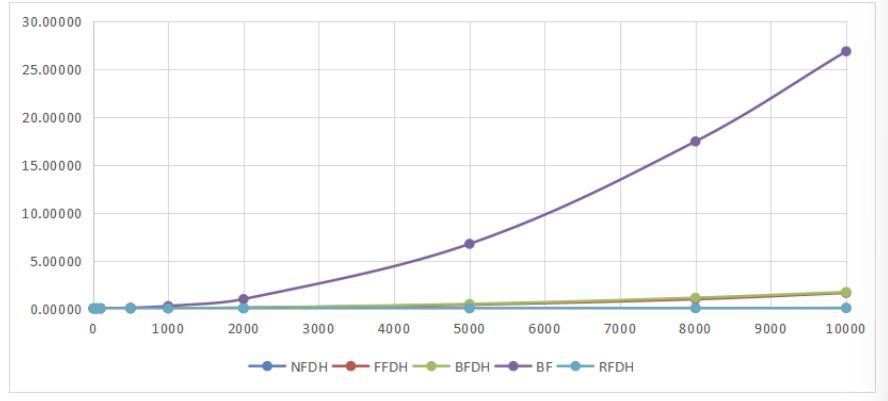
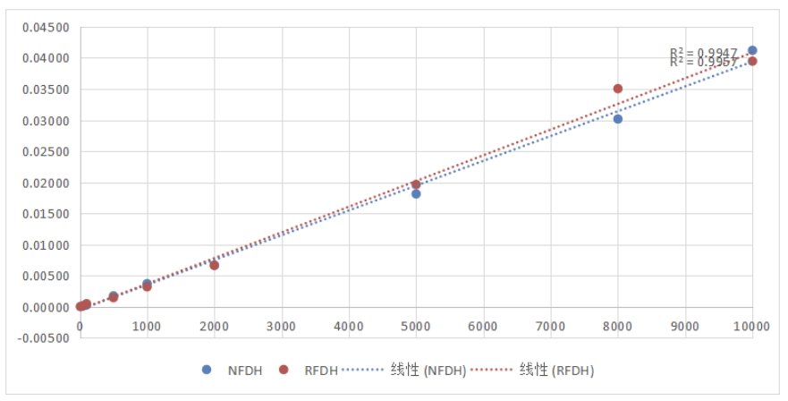
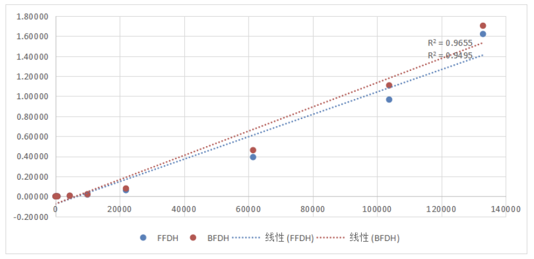
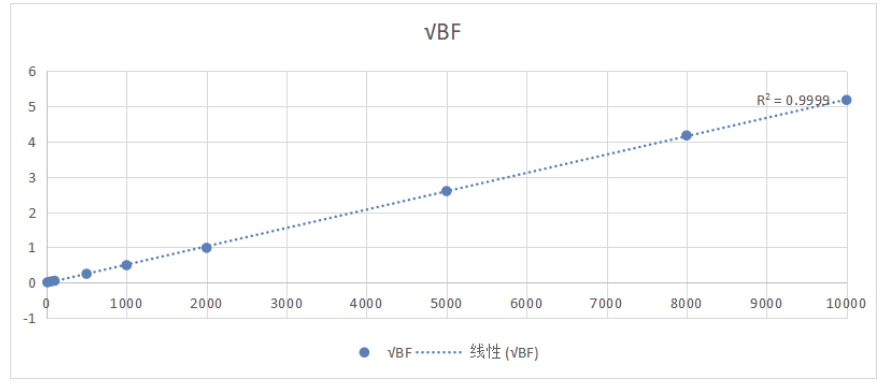

## 1. Introduction

There are n rectangles, each having a width and a height. There is also a bin with a given width. The height of bin can be as large as possible, in other word, is unlimited. The goal is to find the smallest bin height h that can pack all rectangles in?

## 2. Implement Ideas and Theoretical Performance

### 2.1 Storage

Using python's flexible list data structure can greatly reduce the complexity of programming based on the large number of operations that change the size of the array required to use the approximation algorithm in this problem. For all rectangles, it is represented by a list of length 2, the first item of the list is the width and the second item is the height. Then load them all into a list of matrix groups. This is our packing queue.

```python
rectangle = [width, height]
bin = binWidth
rectangleGroup = [rectangle]
```

### 2.2 Algorithm

The problem is a rectangular strip packing problem. Since the bin packing problem is an np-hard problem, its variant stripe packing problem is also an np-hard problem. According to the requirements of the title, we consider using five different approximation methods to solve its approximate solution and analyze its approximate ratio and time complexity.

We assume that we know all the rectangles to be loaded, so the following approximation algorithms are offline algorithms.

Considering the bin packing problem discussed in class, if we layer the strips, the height of each layer does not matter. Suppose again that we can fit rectangles into any layer. Then if we want to achieve the goal of the minimum total height, we need to minimize the number of layers. Think of each layer as a box, and all boxes have a fixed capacity, which is the width of the strip. For each rectangle, we don't consider its height, then its width is the volume of the boxed item. The banding problem then turns into a bin pacing problem. So we can solve it with the following three approximation algorithms for the bin packing problem.

#### 2.2.1 Next-Fit Decreasing Height (NFDH) algorithm

Based on the principle of NF, all rectangles are sorted in decreasing height. It is then loaded into strips in order, with each layer being the height of the rectangle that was loaded first. Since the height is arranged in descending order, the matrix loaded later must be able to fit into this layer in height. The fit strategy is to fit a rectangle if the layer still has enough width to fit it. If the height is insufficient, create a new layer. Finally output the sum of all layers.

```pascal
procedure NFDH(rectangleGroup,width):
	nowLayerWidth = 0 
	height = 0
	for all rectangle in rectangleGroup:
		if nowLayerWidth > rectangleWidth:
			nowLayerWidth -= rectangleWidth
		else
			height += rectangleHeight
			nowLayerWidth = width - rectangleWidth
	return height
```

#### 2.2.2 First-Fit Decreasing Height (FFDH) algorithm

As with NFDH, we first sort the rectangles in descending order of height, and then look for the layers that can be loaded. The difference is that FFDH does not only consider the current layer, but starts to search from the first layer and finds the first layer that can be loaded. Creates a new layer if all layers cannot be loaded.

```pascal
procedure FFDH(rectangleGroup,width):
	nowLayerWidth = 0 
	height = 0
	layerGroup = null
	for all rectangle in rectangleGroup:
		for all layer in layerGroup:
			if layerWidth > rectangleWidth:
				layerWidth -= rectangleWidth
		if all layers can not contain:
			height+=rectangleHeight
			layerGroup add new layer width = width - rectangleWidth
	return height
```

#### 2.2.3 Best-Fit Decreasing Height (BFDH) algorithm

Similar to FFDH, we first sort the rectangles in descending order of height, and then start from the first layer to find the layers that can be loaded. The difference is that BFDH does not find the first layer that can be loaded and loads it, it traverses all layers, finds the most suitable layer, and loads the layer that can be loaded and has the smallest remaining width. Creates a new layer if all layers cannot be loaded.

```pascal
procedure BFDH(rectangleGroup,width):
	nowLayerWidth = 0 
	height = 0
	layerGroup = null
	min = INF
	minLayer = null
	for all rectangle in rectangleGroup:
		for all layer in layerGroup:
			if layerWidth > rectangleWidth:
				if layerWidth < min:
					min = layerWidth
					minLayer = layer
		if minLayer:
			minLayerWidth -= rectangleWidth
		if all layers can not contain:
			height+=rectangleHeight
			layerGroup add new layer width = width - rectangleWidth
	return height
```

In order to comprehensively consider this problem, in addition to the above three approximation algorithms arranged by layers, we also considered two approximation algorithms that are not arranged by layers.

#### 2.2.4 Bottom-Left (BL) Algorithm

BL first order items by non-increasing width. Simply put,  BL packs the next item as near to the bottom as it will fit and then as close to the left as it can go without overlapping with any packed item. In fact, there will be many problems when implementing this algorithm. We approximately consider from the height of the bottom layer up, as long as we find the lower left corner that the rectangle can fit into, that is, the width of the height is sufficient, and then in the area covered by the height of the rectangle. There are no other rectangles in the range, then we update the height information.

```pascal
procedure BF(rectangleGroup,width):
	emptyspaceGroup = []
	for rectangle in rectangleGroup:
		for emptyspace in emptyspaceGroup:
			find the lowest emptyspace
		divide emptyspace into two smaller emptyspace
	return height
```

#### 2.2.5 Reverse-fit (RF) algorithm

Consider the rectangles whose width is greater than 1/2 of the rectangle group. For the group formed by these rectangles, they can only occupy one layer separately and cannot be loaded into the same layer at the same time, so the total height must be greater than or equal to the sum of their heights, that is

$$height \geq \sum height(rectangle_{width>binWidth*0.5})$$

The RF algorithm first stacks these rectangles that are wider than 1/2 the width of the strip, and stacks other rectangles on top of them. For other rectangles, it can be divided into the following piles of ">1/4 width",">1/8 width",">1/16 width"..., by the summation formula of the proportional sequence:

$$1 = \lim_{n->\infty}\frac{1}{2}^n$$

So the total width will not be greater than the width of the strip, which can be put down.

```pascal
procedure NF(rectangleGroup,width):
	for rectangle in rectangleGroup
		if rectangleWidth > width * 0.5
			height += rectangleHeight
	leftHeight = max(LeftGroupheight)
	return height
```

## 3. Testing Results and Analysis

### 3.1 Pressure Test

We selected some values in the range of 10 to 10000 as the values of N and performed a randomly generated box packing test, recording the final box height, packing rate and time spent, and plotted the following chart.



This is a graph of the final height, and we can roughly see that there are roughly two approximation rates, which are detailed in the analysis below.



This is a graph of the packing rate, which can be seen that with the increase of N, the packing rate has hardly changed, indicating that the performance of each algorithm is still relatively stable. The final performance of the packing rate is also in line with the height, and also confirms in practice the approximation rate mentioned below.



The following figure is the time consumed, we can see that the difference is still relatively large, according to the time complexity obtained by the analysis, we plot the algorithms of different complexities to further analyze the correctness of the theory.



These are two of the algorithms with a complexity of O(N), and we draw the image, which can be seen from the R value of the fitted curve as almost a straight line, consistent with theoretical analysis.



These are two algorithms with a complexity of O(Nlog(N)), we draw an image of Nlog(N) corresponding to the abscissa, which can be seen from the fitted curve and R value, which is also basically in line with theoretical analysis.



This is the corresponding complexity of the algorithm of O (N^2), we draw an image of N-√ BF, from the fitted curve and the corresponding R value can be seen that it is also in line with the theoretical results.

### 3.2 Maximum Approximate Ratio Test

updating

## 4. Conclusion and Comment

### 4.1 Theoretical analysis

#### 4.1.1 Time Complexity

For NFDH, we only need to traverse the matrix group once, so the time complexity is

$$T(n)=n=O(n)$$

For FFDH and BFDH, while traversing the matrix group, we also approximately traverse the layer group each time. For the randomly generated matrix, we can think that the width of the matrix is uniformly distributed on (0, strip width), and the total number of strips It can be approximated as log level, so the time spent traversing the strip is log(n)

$$ T(n)=n*\log n=O(n\log n) $$

For BF, every time we insert a matrix, two holes will be generated, and each time we have to traverse the holes to insert a new matrix, so the time complexity is

$ T(n)=n*2n=O(n^2) $

For RF, we traverse the matrix group once each time

$$T(n)=n=O(n)$$

#### 4.1.2 Approximate Ratio

For NFDH, consider the following matrix of width sequences

The approximate ratios of NFDH, FFDH, and BFDH are the same as those mentioned in the class, which are not proved here.

$$NFDH:\rho(2)\\ $$

$$FFDH:\rho(1.7)\\$$

$$BFDH:\rho(1.7)\\$$

For BF, the approximate ratio obtained by consulting the data is

$$BF:\rho(3)\\$$

But in random cases, BF has a good performance

The worst case for the RF algorithm is that all rectangles are between 1/2 and 1/4 of the width and at most twice the height of the optimal case.

$$NF:\rho(2)\\$$

### 4.2 Improve ideas

All five approximation algorithms perform well in test results and complexity and approximation ratio analysis. In practical applications, an appropriate approximation algorithm can be selected according to the requirements and the rectangular characteristics that need to be packed. 

In order to make the result closer to the optimal solution, we can use random algorithms such as genetic algorithm to optimize the approximate solution obtained. In practical applications, the approximation algorithm that performs better can also be selected.

## 5. Source Code

```python
from functools import cmp_to_key
import numpy as py
import random
import pandas as pd
import time
import copy


class StripPacking(object):  # 条带装箱问题类
    def __init__(self):
        self.binWidth = 0  # 箱子宽度
        self.rectangleNum = 0
        self.rectHeightLimit = 0
        self.rectangleGroup = []

    def customSorted(self, x, y):  # 定义比较逻辑，高的矩形排在低的之前
        if x[1] < y[1]:
            return 1
        else:
            return -1

    def NFDH(self):
        timeStart = time.time()
        rectangleList = copy.deepcopy(self.rectangleGroup)
        rectangleList = sorted(rectangleList, key=cmp_to_key(
            self.customSorted))  # 深拷贝矩形列表，并按高度排序
        floor = [self.binWidth, rectangleList[0][1]]  # 把箱子分为层数，最终按层装填
        height = floor[1]
        # NF策略是，检查当前箱子，如果能装下就装入，不能就装入下一个箱子
        while len(rectangleList) > 0:  # 直到所有矩形都被装箱跳出
            rectangle = rectangleList.pop(0)
            if rectangle[0] <= floor[0] and rectangle[1] <= floor[1]:
                # 如果能够装入就装入
                floor[0] -= rectangle[0]
                continue
            else:
                # 装不进去，开辟新层
                floor[0] = self.binWidth - rectangle[0]
                floor[1] = rectangle[1]
                height += floor[1]
        timeEnd = time.time()
        return height, timeEnd-timeStart

    def FFDH(self):
        timeStart = time.time()
        rectangleList = copy.deepcopy(self.rectangleGroup)
        rectangleList = sorted(rectangleList, key=cmp_to_key(
            self.customSorted))  # 深拷贝矩形列表，并按高度排序
        floor = [self.binWidth, rectangleList[0][1]]  # 把箱子分为层数，最终按层装填
        height = floor[1]
        floorGroup = []  # 储存多个箱子
        floorGroup.append(floor)
        # FF策略是，从第一个箱子开始检查，如果能装下就装入，不能就装入下一个箱子，如果都不能就开新箱子
        while len(rectangleList) > 0:  # 直到所有矩形都被装箱跳出
            rectangle = rectangleList.pop(0)
            flag = 1
            for i in range(len(floorGroup)):  # 遍历所有箱子找到能装的第一个箱子
                if rectangle[0] <= floorGroup[i][0] and rectangle[1] <= floorGroup[i][1]:
                    # 如果能够装入就装入
                    floorGroup[i][0] -= rectangle[0]
                    flag = 0
                    break
            if flag:  # 所有箱子都不能装，开辟新层
                floor = [self.binWidth - rectangle[0], rectangle[1]]
                floorGroup.append(floor)
                height += floor[1]
        timeEnd = time.time()
        return height, timeEnd-timeStart

    def BFDH(self):
        timeStart = time.time()
        rectangleList = copy.deepcopy(self.rectangleGroup)
        rectangleList = sorted(rectangleList, key=cmp_to_key(
            self.customSorted))  # 深拷贝矩形列表，并按高度排序
        floor = [self.binWidth, rectangleList[0][1]]  # 把箱子分为层数，最终按层装填
        height = floor[1]
        floorGroup = []  # 储存多个箱子
        floorGroup.append(floor)
        # BF策略是，从第一个箱子开始检查，检查到最后，找到最适合的箱子装入（剩余宽度最小但是可以装下)，如果都不能就开新箱子
        while len(rectangleList) > 0:  # 直到所有矩形都被装箱跳出
            rectangle = rectangleList.pop(0)
            flag = 1
            bestFloor = 0
            minWidth = 0xffffff
            for i in range(len(floorGroup)):  # 遍历所有箱子找到能装的箱子
                if rectangle[0] <= floorGroup[i][0] and rectangle[1] <= floorGroup[i][1]:
                    # 如果能够装入就装入
                    if floorGroup[i][0] < minWidth:#寻找能装下的宽度剩余最小的箱子
                        minWidth = floorGroup[i][0]
                        bestFloor = i
                    flag = 0
            if flag:  # 所有箱子都不能装，开辟新层
                floor = [self.binWidth - rectangle[0], rectangle[1]]
                floorGroup.append(floor)
                height += floor[1]
            else:
                floorGroup[bestFloor][0] -= rectangle[0]
        timeEnd = time.time()
        return height, timeEnd-timeStart
        


sp = StripPacking()
sp.binWidth = float(input("binWidth:"))
sp.rectangleNum = int(input("rectangleNum:"))
sp.rectHeightLimit = float(input("rectHeightLimit:"))
randomFlag = input("randomly create rectangle?(y/n)")
if randomFlag == 'y':  # 随机输入箱子或者手动输入箱子
    for i in range(sp.rectangleNum):
        width = random.random() * sp.binWidth
        height = random.random() * sp.rectHeightLimit
        sp.rectangleGroup.append((width, height))
else:
    for i in range(sp.rectangleNum):
        string = str(input())
        l = [x for x in string.split(' ')]
        width = l[0]
        height = l[1]
        if width > sp.binWidth:
            print("error!")
            i = i - 1
            continue
        if height > sp.rectHeightLimit:
            print("error!")
            i = i - 1
            continue
        sp.rectangleGroup.append((width, height))

#各种近似算法的运行表现
finalHeight, totalTime = sp.NFDH()
print("NFDH height: %f time: %f" % (finalHeight, totalTime))
finalHeight, totalTime = sp.FFDH()
print("FFDH height: %f time: %f" % (finalHeight, totalTime))
finalHeight, totalTime = sp.BFDH()
print("BFDH height: %f time: %f" % (finalHeight, totalTime))
```

