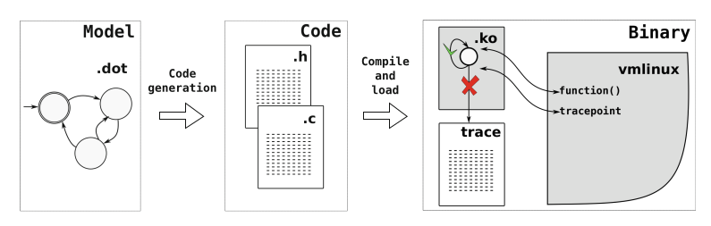
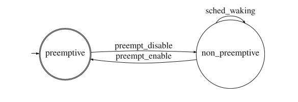
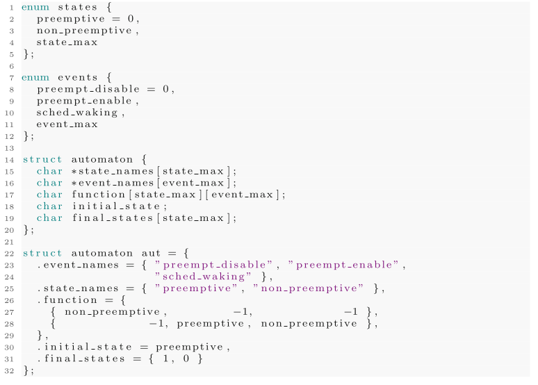
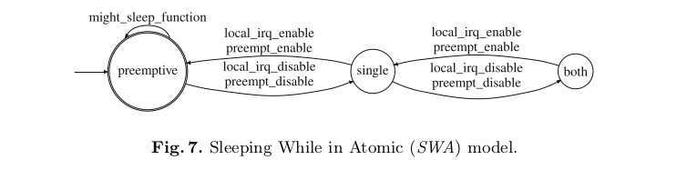
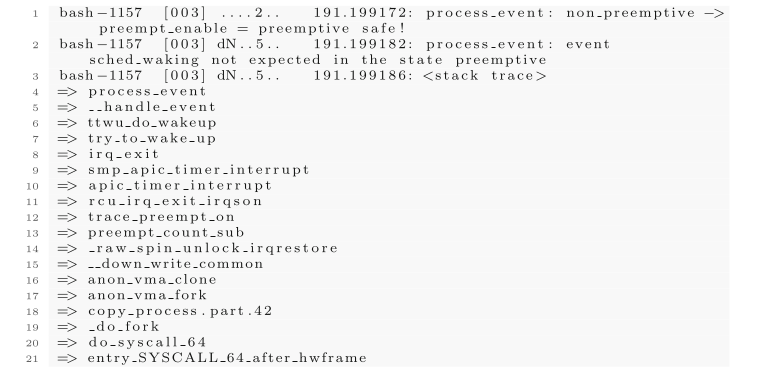
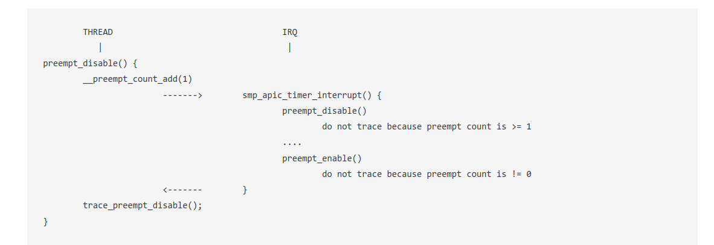
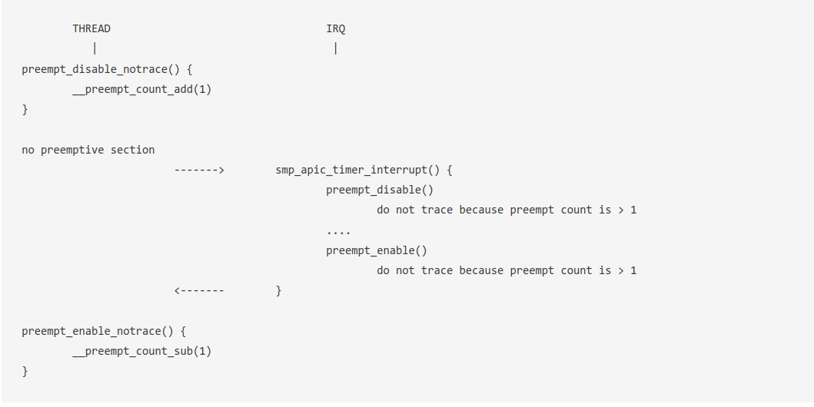
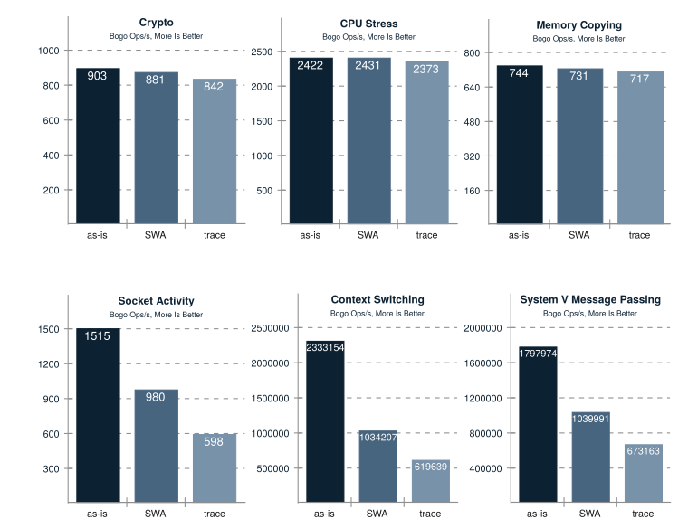
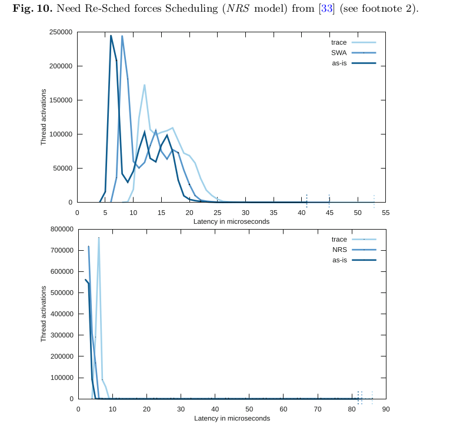

## 1 Introdution

Linux缺少**在运行时**可广泛于所有子系统的形式化验证方法

> Linux lacks a methodology for runtime verification that can be applied broadly throughout all of the in-kernel subsystems.

> Formal verification of the Linux kernel: process of verifying the correctness of the Linux kernel's behavior based on a formal specification

Automata已经在一些较为复杂的Linux子系统中进行应用

之前的方法

1.将事件跟踪到内核缓冲区，然后将数据移动到用户空间，保存到磁盘以供后期处理

​	如果出现一些**高频事件**（调度和同步相关事件等），内核记录、复制到用户空间、保存到磁盘以及后期处理内核事件数据的行为会深刻	地影响系统的时间行为。

2.将验证硬编码到Linux内核代码中

​	不被内核广泛采用。它需要在许多子系统上花费相当大的努力来编写代码，有些复杂的子系统可能具有上千个状态

3.将验证代码作为外部patchset进行维护

​	这要求用户在进行检查之前重新编译内核

## 2 Background

### 2.1 Automata and Discrete Event System

文章说明了**离散事件系统**可以用DFA表示

> discrete event system (DES)：a type of dynamic system that changes its state in response to discrete events that occur over time. 

文章定义DFA的符号如下：

$$ G=\{X,E,f,x_0,X_m\} $$

> – X is the set of states
>
> – E is the finite set of events
>
> – f : $X × E → X$ is the transition function. It defines the state transition in the occurrence of a event from E in the state X.
>
> – $x_0$ is the initial state
>
> – $X_m ⊆ X$ is the set of marked states

### 2.2 Linux Tracing

**function tracer**：跟踪内核函数

**tracepoint**：跟踪系统中发生的事件

**kprobes**：在内核代码的任意位置放置跟踪点

以上方法可以组合排列进行内核跟踪

目前，有两个主要的接口可以从用户空间访问这些功能：**perf**和**Ftrace**。这两个工具都可以连接到跟踪方法，以多种不同的方式处理事件。

## 3 Related Work

updating

## 4 Efficient Formal Verification for the Linux Kernel

### 4.1 Design

文章的主要研究思路如下：

1.用自动机为Linux内核某一个部分的行为建模

比如一个关于抢占式调度的自动机如下：

该自动机描述了当抢占被启用时，不能执行sched_waking

2.使用**dot2c**工具将.dot文件转换为C语言数据结构

自动生成的代码遵循命名约定，允许将其链接到已经能够引用生成的数据结构的内核模块框架，根据指定的模型执行内核中出现的事件的验证。

funtion对event和state的转换速度为O(1)，使用matrix也不会占用过大的空间，自动机需要定义的改变变量只有当前的状态变量，可以轻松地使用原子操作进行处理

3.来自自动机的自动生成代码，以及一组将每个自动机事件与内核事件关联的辅助函数，被编译成一个内核模块（一个.ko文件）

这里作者还展示了一种更加复杂的自动机，在之前的自动机中仅仅使用tracepoint进行tracing，在追踪SWA时同时使用了function tracer

> SWA（Sleeping While in Atomic）是一个有关Linux内核安全的概念，意为“原子状态下睡眠”。它描述了一种不安全的内核编程模式，当一个进程处于原子上下文（例如，禁止中断或禁止抢占）时，进程会因等待某些条件（如互斥锁或信号量）而被阻塞。由于原子上下文不允许调度器切换进程，这种情况可能导致死锁、性能下降或系统崩溃等问题。

**NOTE**：在这个自动机设计中作者在自动机初始化时就链接到了这些可能使进程陷入休眠的函数“might_sleep_function”

生成的内核模块可以在内核执行期间的任何时间加载。在初始化时，模块将处理自动机事件的函数与内核跟踪事件相连接，然后开始验证。验证将持续进行，直至在运行时通过卸载模块来显式禁用它。

下图是其发现error时的打印信息：发现在抢占调度发生时发生了不应该发生的事件sched_waking

### 4.2 Bug Description

**Problem 1:**

如果IRQ发生在线程禁用抢占和追踪禁用事件之间，preempt_irq很有可能会错过在IRQ中发生的抢占禁用。可能的解决方案是在preempt_count_add/sub和跟踪之间禁用IRQ

> IRQ（Interrupt Request，中断请求）是计算机硬件设备与处理器之间通信的一种机制，用于通知处理器设备需要其注意和处理某些任务。当硬件设备需要处理器的响应时，它会发送一个中断信号。处理器在处理完当前任务后，会暂停正在执行的操作，响应这个中断请求，处理中断产生的事件，然后恢复之前被暂停的操作

> preempt_irq跟踪点：用于追踪Linux内核中与抢占中断相关的事件，主要在enable和disable被调用时触发，触发条件是preemt_count >= 1

**Problem 2:**

与上面一个例子相似，`preempt_disable_notrace()` 可能会隐藏一个不是不需要追踪的IRQ（如果它在另一个上下文中，是可以被追踪的）可能的解决方案是：使用每个CPU的计数器来计算可追踪的`preempt_disable/enable`，并根据计数器决定是否打印。

> `preempt_disable_notrace()` 是Linux内核中的一个函数，类似于`preempt_disable()`，它用于禁用抢占调度。不过，与`preempt_disable()`不同的是，`preempt_disable_notrace()`在禁用抢占调度时不会触发与之相关的跟踪点（tracepoint）。这意味着使用`preempt_disable_notrace()`函数时，跟踪工具（如Ftrace或perf）不会记录与禁用抢占调度相关的事件。

以上两个Problem都可能发生在抢占开启的情况下仍然产生sched_waking，因为发生了不期望的中断启用了抢占调度，然后这时出现了sched_waking，tracepoint无法跟踪，模型报错

## 5 Performance Evaluation

文章主要从吞吐量（throughput）和延迟（latency）两个角度衡量性能

### 5.1 Throughput Evaluation

吞吐量评估是使用Phoronix Test  Suite基准测试进行的。相同的实验在三个不同的配置中重复进行。首先，在没有任何跟踪和验证运行的情况下，运行系统的基准测试。然后，在启用SWA模型验证后，在系统中运行基准测试。最后，在被跟踪的系统中进行运行，仅限于验证的自动机中使用的事件。值得一提的是，实验中的跟踪仅指记录事件。在用户空间中进行完整的验证仍然需要将数据复制到用户空间并进行验证，这将增加更多的开销。

> Phoronix Test  Suite（PTS）是一个开源的、跨平台的基准测试和性能分析工具。它可以用于对计算机硬件、系统、软件的性能进行测试和分析。Phoronix  Test Suite旨在提供一个易于使用、自动化的基准测试过程，包括自动化的测试安装、执行和报告功能。Phoronix Test  Suite由Phoronix开发，支持多种操作系统，包括Linux、macOS和Windows。这个工具包主要用于评估计算机系统的吞吐量、延迟和其他性能指标。

相对于trace的方法，SWA-Model对大多数活动都有显著的性能提升

同时它也起到了验证的作用

### 5.2 Latency Evaluation

延迟被定义为在新激活过程中，由于**内核同步而导致具有最高实时优先级的线程所遭受的延迟**。Linux实践者使用cyclictest工具来测量这种延迟，同时使用rteval作为背景工作负载，产生密集的内核激活。

