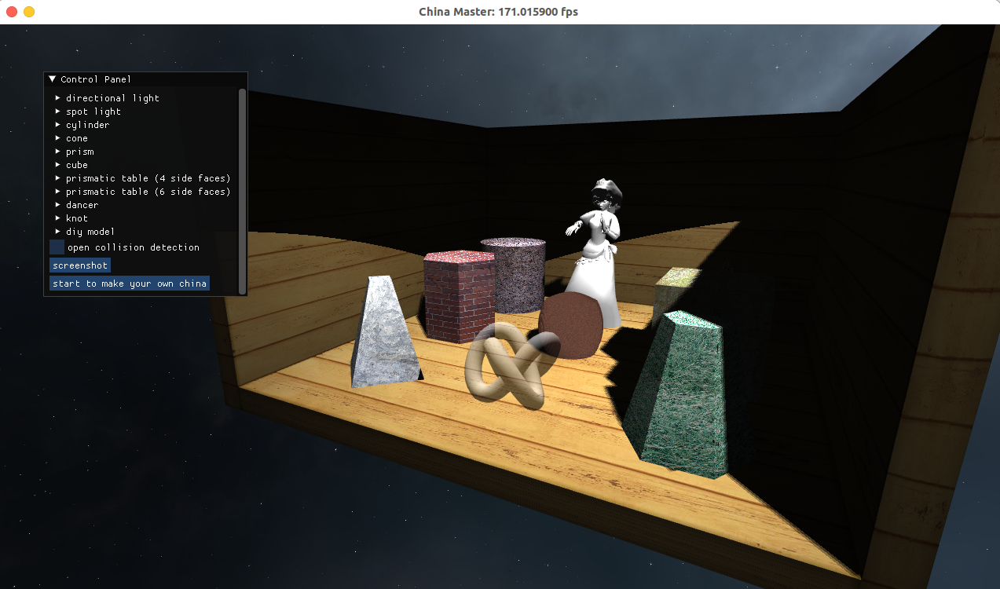
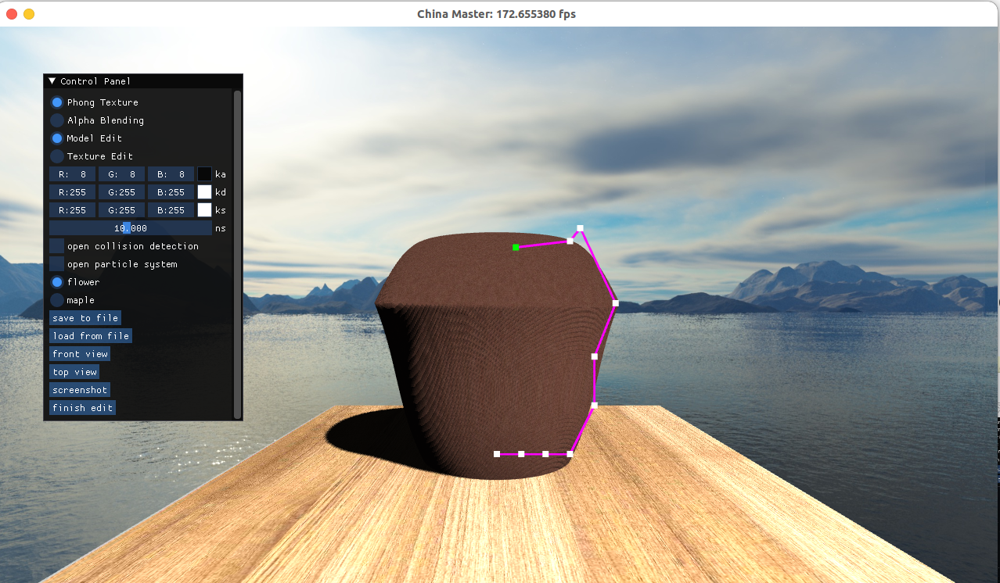
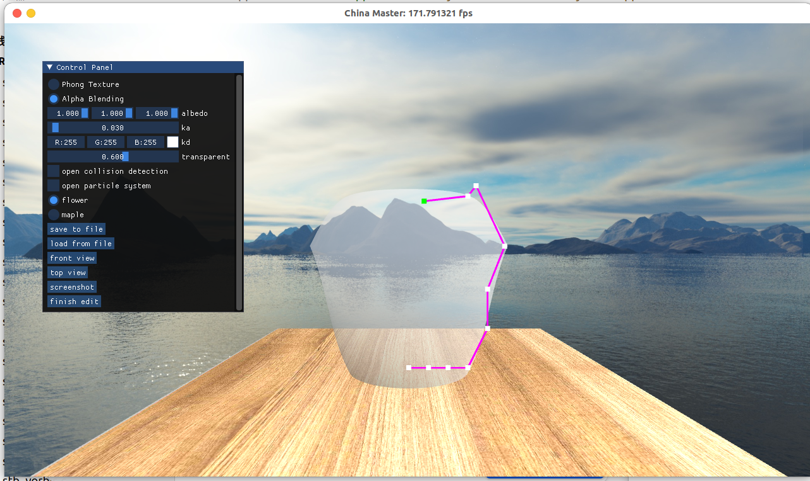
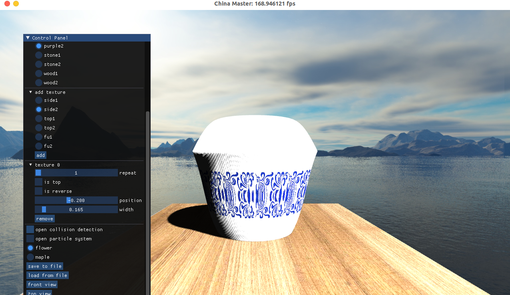
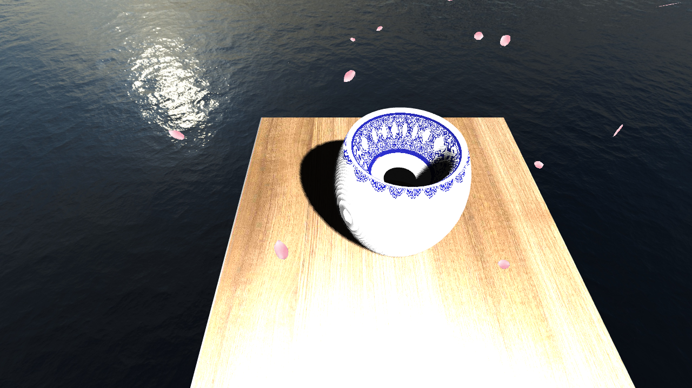
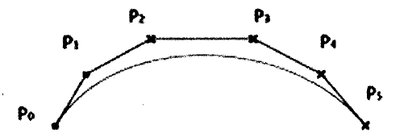

## 1 总体说明

本程序实现了一个较为完善的冯氏光照模型和贝塞尔曲线建模器，并且依照该模型实现了一个简易的陶艺大师小游戏，所实现的功能有大作业要求的所有基础功能，以及NURBS曲线——贝塞尔曲线的建模、鼠标拖动锚点编辑、显示和导出、基于冯氏光照的点光源和平行光源实时阴影、基于着色器和贝塞尔曲面的程序纹理贴图器、基于AABB包围盒的碰撞检测功能、透明物体绘制（透明度检测、透明度混合和深度剥离算法），场景实时空气中粒子渲染以及基于以上功能实现的陶艺大师小游戏。本程序的简易操作说明如下：

（1）程序启动时，场景初始视角位于展示台斜前上端，并指向展示台。

（2）按下LCtrl键可实现对场景的漫游；同时，分别按下 W, A, S D 键可分别实现向前/左/后/右平移；分别按下I, O, F键可分别实现Zoom In/Zoom Out/Zoom To Fit.

（3）分别在各个几何体的子菜单栏中按下按钮"pan to it"，可以对场景中所选中的几何体进行视线追踪(Pan)，且不受该几何体的各种几何变换的影响。

（4）分别在各个几何体的子菜单栏中按下按钮"save as .obj file"，可以对场景中的几何体进行导出模型的操作，导出的obj模型会出现在 名为output的文件夹下。

（5）在菜单栏中按下按钮"screenshot"可以对场景进行截图，生成的图片(png格式)会出现在名为output的文件夹下

（6）选中knot物体可以观察和调整透明度混合算法所构造的模型

（7）点选游戏开始就可以进入游戏界面



（8）在曲面编辑模式下可以使用贝塞尔曲线进行三维网格建模，支持增加和删除锚点的操作：鼠标左键点选控制拖曳点进行建模，中键点击线段进行分裂加点，右键点击点进行删除



（9）也可以用透明度混合算法显示模型



（10）进入纹理编辑模式后可以切换基础纹理材质，选择适合的重复方式，纹理位置，环绕方式，纹理大小等



（11）同时也可以开启场景粒子效果，场景中会有飘落的花瓣或树叶，还会在桌面上停留。

（12）该场景支持模型的导出和加载，摄像机键盘操作视角变化，截图等

（13）花费一些时间进行游玩，可以得到非常复杂且好看的瓷器、桌椅等器件，截到完美的图片



## 2 运行平台

Linux GCC 22

## 3 各功能具体实现

### 3.1 基本几何体建模

本程序如下定义了结构体Wall和Geometry，分别用于存储展示台的四面墙壁以及六种不同的几何体，以及透明物体、可编辑的贝塞尔曲面模型等：

```c++
struct Wall
{
	Model *floor;
	Model *back;
	Model *left;
	Model *right;
};

struct Geometry
{
	Model *cylinder;
	Model *cone;
	Model *prism;
	Model *cube;
	Model *prismaticTable4;
	Model *prismaticTable6;
	Model *knot;
	DIYmodel *gameObject;
};
```

### 3.2 基本三维网格导入及导出

#### 3.2.1 导入

三维网格的导入代码写在了Model类的构造函数中：

```c++
Model::Model(const std::string& filepath) {
	std::vector<Vertex> vertices;
	std::vector<uint32_t> indices;
	std::unordered_map<Vertex, uint32_t> uniqueVertices;
	std::vector<glm::vec3> v, vn;
	std::vector<glm::vec2> vt;
	std::string line, str;
	float f;
	int i = 0;

	std::ifstream filein;
	filein.open(filepath.c_str());

	while (getline(filein, line)) {
		if (line[0] == 'v') {
			if (line[1] == 'n') {
				std::istringstream in(line);
				glm::vec3 data;
				in >> str >> data.x >> data.y >> data.z;
				vn.push_back(data);
			}
			else if (line[1] == 't') {
				std::istringstream in(line);
				glm::vec2 data;
				in >> str >> data.x >> data.y;
				vt.push_back(data);
			}
			else {
				std::istringstream in(line);
				glm::vec3 data;
				in >> str >> data.x >> data.y >> data.z;
				v.push_back(data);
			}
		}
		else if (line[0] == 'f') {
			std::istringstream in(line);
			in >> str;
			if (count(line.begin(), line.end(), '/') == 6) {
				int index[3][3] = { 0, 0, 0 };
				Vertex vertex[3];
				for (int i = 0; i < 3; i++) {
					in >> str;
					size_t pos1 = str.find_first_of('/');
					size_t pos2 = str.find_last_of('/');
					if (pos1 != 0) {
						index[i][0] = stof(str.substr(0, pos1));
						vertex[i].position = v[index[i][0] - 1];
					}
					if (pos1 + 1 != pos2) {
						index[i][1] = stof(str.substr(pos1 + 1, pos2));
						vertex[i].texCoord = vt[index[i][1] - 1];
					}
					if (pos2 + 1 != str.length()) {
						index[i][2] = stof(str.substr(pos2 + 1));
						vertex[i].normal = vn[index[i][2] - 1];
					}
					if (uniqueVertices.count(vertex[i]) == 0) {
						uniqueVertices[vertex[i]] = static_cast<uint32_t>(vertices.size());
						vertices.push_back(vertex[i]);
					}
				}
				indices.push_back(uniqueVertices[vertex[0]]);
				indices.push_back(uniqueVertices[vertex[1]]);
				indices.push_back(uniqueVertices[vertex[2]]);
			}
			else if (count(line.begin(), line.end(), '/') == 8) {
				int index[4][3] = { 0, 0, 0 };
				Vertex vertex[4];
				for (int i = 0; i < 4; i++) {
					in >> str;
					size_t pos1 = str.find_first_of('/');
					size_t pos2 = str.find_last_of('/');
					if (pos1 != 0) {
						index[i][0] = stof(str.substr(0, pos1));
						vertex[i].position = v[index[i][0] - 1];
					}
					if (pos1 + 1 != pos2) {
						index[i][1] = stof(str.substr(pos1 + 1, pos2));
						vertex[i].texCoord = vt[index[i][1] - 1];
					}
					if (pos2 + 1 != str.length()) {
						index[i][2] = stof(str.substr(pos2 + 1));
						vertex[i].normal = vn[index[i][2] - 1];
					}
					if (uniqueVertices.count(vertex[i]) == 0) {
						uniqueVertices[vertex[i]] = static_cast<uint32_t>(vertices.size());
						vertices.push_back(vertex[i]);
					}
				}
				indices.push_back(uniqueVertices[vertex[0]]);
				indices.push_back(uniqueVertices[vertex[1]]);
				indices.push_back(uniqueVertices[vertex[2]]);
				indices.push_back(uniqueVertices[vertex[2]]);
				indices.push_back(uniqueVertices[vertex[3]]);
				indices.push_back(uniqueVertices[vertex[0]]);
			}
		}
	}

    _vertices = vertices;
    _indices = indices;
    
	_phongMaterial.reset(new PhongMaterial());
	_phongMaterial->ka = glm::vec3(0.03f, 0.03f, 0.03f);
	_phongMaterial->kd = glm::vec3(1.0f, 1.0f, 1.0f);
	_phongMaterial->ks = glm::vec3(1.0f, 1.0f, 1.0f);
	_phongMaterial->ns = 10.0f;

    computeBoundingBox();

    initGLResources();

    GLenum error = glGetError();
    if (error != GL_NO_ERROR) {
        cleanup();
        throw std::runtime_error("OpenGL Error: " + std::to_string(error));
    }
}
```

#### 3.2.2 导出

三维网格的导入代码在Model类中通过函数saveAsObjFile实现。程序运行中，可通过分别在各个几何体的子菜单栏中按下按钮"save as .obj file"，从而实现对场景中的几何体进行导出模型的操作，导出的obj模型会出现在名为output的文件夹下。

```c++
void Model::saveAsObjFile(const std::string& filename) const {
	std::ofstream  fileout("../output/" + filename + ".obj", std::ios::out);
	fileout << "mtllib "+filename+".mtl" << std::endl;
	fileout << "g default" << std::endl;
	for (int i = 0; i < _vertices.size(); i++) {
		fileout << std::setiosflags(std::ios::fixed) << std::setprecision(6);
		fileout << "v " << _vertices[i].position.x << ' ' << _vertices[i].position.y << ' ' << _vertices[i].position.z << std::endl;
	}
	for (int i = 0; i < _vertices.size(); i++) {
		fileout << std::setiosflags(std::ios::fixed) << std::setprecision(6);
		fileout << "vt " << _vertices[i].texCoord.x << ' ' << _vertices[i].texCoord.y << std::endl;
	}
	for (int i = 0; i < _vertices.size(); i++) {
		fileout << std::setiosflags(std::ios::fixed) << std::setprecision(6);
		fileout << "vn " << _vertices[i].normal.x << ' ' << _vertices[i].normal.y << ' ' << _vertices[i].normal.z << std::endl;
	}
	fileout << "s 1" << std::endl;
	fileout << "g p"+filename+"1" << std::endl;
	fileout << "usemtl file1" << std::endl;
	for (int i = 0; i < (_indices.size() / 3); i++) {
		fileout << std::setiosflags(std::ios::fixed) << std::setprecision(0);
		fileout << "f " << ' ' << _indices[3 * i] + 1 << '/' << _indices[3 * i] + 1 << '/' << _indices[3 * i] + 1 << ' '
								<< _indices[3 * i + 1] + 1 << '/' << _indices[3 * i + 1] + 1 << '/' << _indices[3 * i + 1] + 1 << ' '
								<< _indices[3 * i + 2] + 1 << '/' << _indices[3 * i + 2] + 1 << '/' << _indices[3 * i + 2] + 1 << std::endl;
	}
}
```

### 3.3 基本材质、纹理显示及编辑

#### 3.3.1 纹理导入

纹理通过 Texture2D类储存，其与平时作业中的Texture2D类完全一致，故在此不做代码展示；载入纹理时只需要纹理图片的路径即可

```c++
_texture.wood.reset(new Texture2D(woodTexturePath));
_texture.brick.reset(new Texture2D(brickTexturePath));
_texture.marbleBrown.reset(new Texture2D(marbleBrownTexturePath));
_texture.marblePurple.reset(new Texture2D(marblePurpleTexturePath));
_texture.metalBare.reset(new Texture2D(metalBareTexturePath));
_texture.metalPainted.reset(new Texture2D(metalPaintedTexturePath));
_texture.plastic.reset(new Texture2D(plasticTexturePath));
```

#### 3.3.2 纹理显示

在帧渲染中使用纹理之前，需要先激活纹理、绑定纹理，并设置好纹理编号（以编号为1的纹理为例）：

```c++
glActiveTexture(GL_TEXTURE1);
_texture.wood->bind();
...
_phongShader->setInt("mapKd", 1);
```

为使用纹理，需要在着色器_phongShader中声明一个sampler2D类型的uniform变量：mapKd，从而把一个纹理添加到片段着色器中。在帧渲染中，纹理会被赋值给此uniform；而在片段着色器中，GLSL内置的texture函数来会对纹理进行颜色采样。

#### 3.3.3 phong材质

在Model类中定义了结构体PhongMaterial，以储存Phong材质；在片段着色器中也定义了相对应的结构体及其 uniform 变量。

```c++
struct PhongMaterial {
glm::vec3 ka;
glm::vec3 kd;
glm::vec3 ks;
float ns;
};
std::unique_ptr<PhongMaterial> _phongMaterial;
```

在片段着色器中，可以使用材质参数对环境光，漫反射，镜面反射进行叠加修改，从而得到我们想要的光照效果。在菜单中可以分别对各个几何体的材质进行改变。

### 3.4 基本几何变换

通过在各个几何体的子菜单栏中分别调节平移量、旋转角度以及缩放量的各个分量，可以实现不同的平移、旋转以及缩放的叠加效果（以圆柱体的子菜单为例，展示菜单的构成）：

```c++
if (ImGui::TreeNode("cone"))
		{
			ImGui::SliderFloat3("position##2", (float *)&_geometry.cone->position, -4.0f, 4.0f);
			ImGui::SliderFloat3("rotation##2", (float *)&_geometry.cone->rotateangle, -4.0f, 4.0f);
			ImGui::SliderFloat3("scale##2", (float *)&_geometry.cone->scale, 0.5f, 2.0f);
			ImGui::ColorEdit3("ka##2", (float *)&_geometry.cone->_phongMaterial->ka);
			ImGui::ColorEdit3("kd##2", (float *)&_geometry.cone->_phongMaterial->kd);
			ImGui::ColorEdit3("ks##2", (float *)&_geometry.cone->_phongMaterial->ks);
			ImGui::SliderFloat("ns##2", (float *)&_geometry.cone->_phongMaterial->ns, 1.0f, 20.0f);
			if (ImGui::Button("save as .obj file##2") == true)
				_geometry.cone->saveAsObjFile("cone");
			if (ImGui::Button("pan to it##2") == true)
				panIndex = ((panIndex == 0) ? 2 : 0);
			ImGui::TreePop();
			ImGui::Separator();
		}
```

由于在各个轴的旋转角度由vec3变量rotateangle记录，而四元数rotation记录了每个几何体的旋转情况，因此要在每次帧渲染开始的时候，调用Model类函数computeRotationQuat()，以由给定的rotateangle计算正确的rotation。注意，这里的三个以old起始的变量是为了之后的Pan功能正确实现而设置的。

``` c++
void Model::computeRotationQuat() {
rotation = glm::quat{ 1.0f, 0.0f, 0.0f, 0.0f };
oldright = getRight();
rotation = glm::quat{ cos(rotateangle.x / 2.0f), getRight().x *
sin(rotateangle.x / 2.0f), getRight().y * sin(rotateangle.x / 2.0f),
getRight().z * sin(rotateangle.x / 2.0f) } * rotation;
oldup = getUp();
rotation = glm::quat{ cos(rotateangle.y / 2.0f), getUp().x *
sin(rotateangle.y / 2.0f), getUp().y * sin(rotateangle.y / 2.0f), getUp().z *
sin(rotateangle.y / 2.0f) } * rotation;
oldfront = getFront();
rotation = glm::quat{ cos(rotateangle.z / 2.0f), -getFront().x *
sin(rotateangle.z / 2.0f), -getFront().y * sin(rotateangle.z / 2.0f), -
getFront().z * sin(rotateangle.z / 2.0f) } * rotation;
}
```

### 3.5 基本光照模型及光源编辑

#### 3.5.1 光照模型

本程序使用了Phong光照模型，通过给定摄像机位置、模型位置及光源位置，可以分别计算物体的环境光照分量、漫反射分量以及镜面反射分量，最后再将三者加和，即可得到最终的颜色。在之后的程序纹理映射和阴影实现中需要对冯氏光照进行相应的修改，着色器在之后的部分予以说明

#### 3.5.2 光源编辑

程序中设置了一个平行光源和一个点光源，且在点光源发出的位置有一个恒为白色的球体，以指示点光源位置（这个球体与其他几何体不使用同一个着色器）。在菜单栏中，可分别调节点光源的位置、方向、强度及颜色以及平行光源的方向、强度及颜色。其中，调节点光源的位置实际上是调节球体的位置，而在每一帧渲染时，再将球体的位置赋值给点光源的位置。编辑光源相关参数的菜单构成如下：

```c++
if (ImGui::TreeNode("directional light"))
		{
			ImGui::SliderFloat("x direction##1", (float *)&_directionalLight->direction.x, -1.0f, 1.0f);
			ImGui::SliderFloat("z direction##1", (float *)&_directionalLight->direction.z, -1.0f, 1.0f);
			ImGui::SliderFloat("intensity##1", (float *)&_directionalLight->intensity, 0.0f, 1.0f);
			ImGui::ColorEdit3("color##1", (float *)&_directionalLight->color);
			ImGui::TreePop();
			ImGui::Separator();
		}
		if (ImGui::TreeNode("spot light"))
		{
			ImGui::SliderFloat("x position##2", (float *)&_spotLightSphere->position.x, -5.0f, 5.0f);
			ImGui::SliderFloat("y position##2", (float *)&_spotLightSphere->position.y, 5.0f, 15.0f);
			ImGui::SliderFloat("z position##2", (float *)&_spotLightSphere->position.z, 5.0f, 15.0f);
			ImGui::SliderFloat("x direction##2", (float *)&_spotLight->direction.x, -1.0f, 1.0f);
			ImGui::SliderFloat("z direction##2", (float *)&_spotLight->direction.z, -1.0f, 1.0f);
			ImGui::SliderFloat("intensity##2", (float *)&_spotLight->intensity, 0.0f, 2.0f);
			ImGui::SliderFloat("angle##2", (float *)&_spotLight->angle, glm::radians(0.0f), glm::radians(120.0f));
			ImGui::ColorEdit3("color##2", (float *)&_spotLight->color);
			ImGui::TreePop();
			ImGui::Separator();
		}
```

### 3.6 场景漫游

在handleInput()函数中，需按下LCtrl键，才能调用3.6.1和3.6.2中的功能；相反地，按下LCtrl键后，3.6.3中的功能将被禁用。

#### 3.6.1 平移、旋转

分别按下 W, A, S D 键可分别实现向前/左/后/右平移（bool类型的变量Opencd是用来记录是否执行碰撞检测的变量，函数isInBoundingBoxGlobal()是用来进行碰撞检测的函数，具体内容将会在3.8中详细介绍）。

```c++
        	showCursor = false;
			glfwSetInputMode(_window, GLFW_CURSOR, GLFW_CURSOR_DISABLED);
			if (firstPressControl == true)
			{
				firstPressControl = false;
				_mouseInput.move.xOld = _mouseInput.move.xCurrent = 0.5 * _windowWidth;
				_mouseInput.move.yOld = _mouseInput.move.yCurrent = 0.5 * _windowHeight;
				glfwSetCursorPos(_window, _mouseInput.move.xCurrent, _mouseInput.move.yCurrent);
			}

			constexpr float cameraMoveSpeed = 0.02f;
			constexpr float cameraRotateSpeed = 0.015f;

			if (_keyboardInput.keyStates[GLFW_KEY_SPACE] == GLFW_PRESS)
			{
				// std::cout << "switch camera" << std::endl;
				//  switch camera
				activeCameraIndex = (activeCameraIndex + 1) % _cameras.size();
				_keyboardInput.keyStates[GLFW_KEY_SPACE] = GLFW_RELEASE;
				return;
			}

			Camera *camera = _cameras[activeCameraIndex];

			if (_keyboardInput.keyStates[GLFW_KEY_W] != GLFW_RELEASE)
			{
				// std::cout << "W" << std::endl;
				camera->position += 0.1f * camera->getFront();
				if (opencd == true && isInBoundingBoxGlobal(camera))
				{
					camera->position -= 0.1f * camera->getFront();
				}
			}

			if (_keyboardInput.keyStates[GLFW_KEY_A] != GLFW_RELEASE)
			{
				// std::cout << "A" << std::endl;
				camera->position -= 0.1f * camera->getRight();
				if (opencd == true && isInBoundingBoxGlobal(camera))
				{
					camera->position += 0.1f * camera->getRight();
				}
			}

			if (_keyboardInput.keyStates[GLFW_KEY_S] != GLFW_RELEASE)
			{
				// std::cout << "S" << std::endl;
				camera->position -= 0.1f * camera->getFront();
				if (opencd == true && isInBoundingBoxGlobal(camera))
				{
					camera->position += 0.1f * camera->getFront();
				}
			}

			if (_keyboardInput.keyStates[GLFW_KEY_D] != GLFW_RELEASE)
			{
				// std::cout << "D" << std::endl;
				camera->position += 0.1f * camera->getRight();
				if (opencd == true && isInBoundingBoxGlobal(camera))
				{
					camera->position -= 0.1f * camera->getRight();
				}
			}

			if (_mouseInput.move.xCurrent != _mouseInput.move.xOld)
			{
				// std::cout << "mouse move in x direction" << std::endl;
				float mouse_movement_in_x_direction = cameraRotateSpeed * (_mouseInput.move.xCurrent - _mouseInput.move.xOld);
				glm::quat q = glm::angleAxis(glm::radians(-mouse_movement_in_x_direction), glm::vec3(0.0f, 1.0f, 0.0f));
				camera->rotation = q * camera->rotation;
				_mouseInput.move.xOld = _mouseInput.move.xCurrent;
			}

			if (_mouseInput.move.yCurrent != _mouseInput.move.yOld)
			{
				// std::cout << "mouse move in y direction" << std::endl;
				float mouse_movement_in_y_direction = cameraRotateSpeed * (_mouseInput.move.yCurrent - _mouseInput.move.yOld);
				glm::quat q = glm::angleAxis(glm::radians(-mouse_movement_in_y_direction), glm::vec3(camera->getRight().x, camera->getRight().y, camera->getRight().z));
				camera->rotation = q * camera->rotation;
				_mouseInput.move.yOld = _mouseInput.move.yCurrent;
			}
```

#### 3.6.2 Zoom In / Zoom Out / Zoom To Fit

分别按下I, O, F键可分别实现Zoom In/Zoom Out/Zoom To Fit。其中，Zoom In通过减小摄像机fovy并增大znear, zfar实现；Zoom Out通过增大摄像机fovy并减小znear, zfar实现；Zoom To Fit通过重置这三个变量实现

```c++
if (_keyboardInput.keyStates[GLFW_KEY_I] != GLFW_RELEASE)
			{
				// std::cout << "I" << std::endl;
				if (camera->fovy >= glm::radians(30.0f))
				{
					camera->fovy -= glm::radians(0.5f);
					camera->znear += 0.001;
					camera->zfar += 100.0;
				}
			}

			if (_keyboardInput.keyStates[GLFW_KEY_O] != GLFW_RELEASE)
			{
				// std::cout << "O" << std::endl;
				if (camera->fovy <= glm::radians(89.5f))
				{
					camera->fovy += glm::radians(0.5f);
					camera->znear -= 0.001;
					camera->zfar -= 100.0;
				}
			}

			if (_keyboardInput.keyStates[GLFW_KEY_F] != GLFW_RELEASE)
			{
				// std::cout << "F" << std::endl;
				camera->fovy = glm::radians(60.0f);
				camera->znear = 0.1;
				camera->zfar = 10000.0;
			}
```

#### 3.6.3 Pan

分别在各个几何体的子菜单栏中按下按钮"pan to it"，可以对场景中所选中的几何体进行视线追踪(Pan)，且不受该几何体的各种几何变换的影响。其实现原理为：将摄像机的位置重置为该几何体的斜前上方，通过该几何体的rotateangle以及诸多以old开头的变量，以使摄像机完成与几何体相同的旋转操作，最后再将摄像机沿右轴旋转一定角度，从而实现镜头永远以相同的姿态看向该几何体。程序中以变量panIndex记录当前被视线追踪的几何体。下面为设置摄像机位置及视角的函数setPanCamera()：

```c++
void FinalProject::setPanCamera(Model* model) {
_cameras[activeCameraIndex]->position = model->position + model->getFront()
* -5.0f + model->getUp() * 5.0f;
_cameras[activeCameraIndex]->rotation = glm::quat{ 1.0f, 0.0f, 0.0f, 0.0f };
_cameras[activeCameraIndex]->rotation = glm::quat{ cos(model->rotateangle.x
/ 2.0f), model->oldright.x * sin(model->rotateangle.x / 2.0f), model->oldright.y
* sin(model->rotateangle.x / 2.0f), model->oldright.z * sin(model->rotateangle.x
/ 2.0f) } *_cameras[activeCameraIndex]->rotation;
_cameras[activeCameraIndex]->rotation = glm::quat{ cos(model->rotateangle.y
/ 2.0f), model->oldup.x * sin(model->rotateangle.y / 2.0f), model->oldup.y *
sin(model->rotateangle.y / 2.0f), model->oldup.z * sin(model->rotateangle.y /
2.0f) } *_cameras[activeCameraIndex]->rotation;
_cameras[activeCameraIndex]->rotation = glm::quat{ cos(model->rotateangle.z
/ 2.0f), -model->oldfront.x * sin(model->rotateangle.z / 2.0f), -model-
>oldfront.y * sin(model->rotateangle.z / 2.0f), -model->oldfront.z * sin(model-
>rotateangle.z / 2.0f) } *_cameras[activeCameraIndex]->rotation;
_cameras[activeCameraIndex]->rotation = glm::quat{ cos(-0.25f), model-
>getRight().x * sin(-0.25f), model->getRight().y * sin(-0.25f), model-
>getRight().z * sin(-0.25f) } *_cameras[activeCameraIndex]->rotation;
}
```

### 3.7 动画播放及截屏

#### 3.7.1 动画播放

使用Model类型的向量 _postures来存储obj模型序列，并在程序初始化的时候依次导入：

```c++
std::vector<std::unique_ptr<Model>> _postures;
...
std::string posturePath;
_postures.resize(101);
for (int i = 0; i <= 100; i++) {
posturePath = "../media/postures/pose0" + std::to_string(i) + ".obj";
_postures[i].reset(new Model(posturePath));
_postures[i]->position = glm::vec3{ 0.0f, 0.0f, -2.5f };
_postures[i]->scale = glm::vec3{ 0.02f, 0.02f, 0.02f };
}
```

在帧渲染时，使用特别为此序列配置的着色器，并传递相关变量，最终依次绘制每一obj模型。程序中使用变量postureFrameNumber记录当前绘制的帧的序号：当序号超过obj模型序列中的模型总数时，序号归零：

```c++
...
_postures[postureFrameNumber++]->draw();
if (postureFrameNumber > 100) postureFrameNumber = 0;
```

#### 3.7.2 截屏

在菜单栏中按下按钮"screenshot"，可以调用函数screenShot()，以对场景进行截图，生成的图片(png
格式)会出现在名为output的文件夹下。此函数借助于stb库实现：

```c++
void FinalProject::screenShot()
{
	std::string savePath = "../output/output.png";
	GLubyte *pPixelData;
	GLint PixelDataLength;
	pPixelData = (GLubyte *)malloc(_windowWidth * _windowHeight * 3);
	if (pPixelData == 0)
		return;
	glPixelStorei(GL_UNPACK_ALIGNMENT, 4);
	glReadPixels(0, 0, _windowWidth, _windowHeight, GL_RGB, GL_UNSIGNED_BYTE, pPixelData);
	stbi_write_png(savePath.c_str(), _windowWidth, _windowHeight, 3, pPixelData, 0);
	free(pPixelData);
	int iw = _windowWidth, ih = _windowHeight, n = 3;
	stbi_set_flip_vertically_on_load(true);
	unsigned char *idata = stbi_load(savePath.c_str(), &iw, &ih, &n, 0);
	stbi_write_png(savePath.c_str(), _windowWidth, _windowHeight, 3, idata, 0);
	stbi_image_free(idata);
}
```

### 3.8 碰撞检测

此程序中的碰撞检测基于AABB碰撞盒实现。程序中使用布尔型变量opencd记录是否开启碰撞检测。当
勾选菜单中的"open collision detection"选项时，开启碰撞检测；取消勾选则关闭碰撞检测（程序默认
关闭碰撞检测）。开启碰撞检测之后，在按下W, A, S, D键后，都会触发碰撞判定

函数isInBoundingBoxGlobal()实现如下：遍历场景中的各个物体，分别进行碰撞检测：有任何一个物体
与摄像机碰撞则传回true, 否则传回false.

```c++
bool FinalProject::isInBoundingBoxGlobal(Camera *camera)
{
	if (!gameMode && (_wall.floor->isInBoundingBoxGlobal(camera) ||
					  _wall.back->isInBoundingBoxGlobal(camera) ||
					  _wall.left->isInBoundingBoxGlobal(camera) ||
					  _wall.right->isInBoundingBoxGlobal(camera) ||
					  _geometry.cylinder->isInBoundingBoxGlobal(camera) ||
					  _geometry.cone->isInBoundingBoxGlobal(camera) ||
					  _geometry.prism->isInBoundingBoxGlobal(camera) ||
					  _geometry.cube->isInBoundingBoxGlobal(camera) ||
					  _geometry.prismaticTable4->isInBoundingBoxGlobal(camera) ||
					  _geometry.prismaticTable6->isInBoundingBoxGlobal(camera) ||
					  _geometry.gameObject->isInBoundingBoxGlobal(camera) ||
					  _postures[postureFrameNumber / 5]->isInBoundingBoxGlobal(camera) ||
					  _geometry.knot->isInBoundingBoxGlobal(camera)))
		return true;
	else if (gameMode && (_wall.floor->isInBoundingBoxGlobal(camera) ||
						  _geometry.gameObject->isInBoundingBoxGlobal(camera)))
		return true;
	else
		return false;
}
```

Model类函数isInBoundingBoxGlobal()实现如下：首先，在模型载入时会调用函数computeBoudingBox()计算局部空间中的碰撞盒；其次，在触发判定函数之后会由变换矩阵计算世界空间中的碰撞盒；最后，判定摄像机的位置是否过于靠近碰撞盒/在碰撞盒内：是则传回true, 否则传回false.

```c++
void Model::computeBoundingBox() {
    float minX = std::numeric_limits<float>::max();
    float minY = std::numeric_limits<float>::max();
    float minZ = std::numeric_limits<float>::max();
    float maxX = -std::numeric_limits<float>::max();
    float maxY = -std::numeric_limits<float>::max();
    float maxZ = -std::numeric_limits<float>::max();

    for (const auto& v : _vertices) {
        minX = std::min(v.position.x, minX);
        minY = std::min(v.position.y, minY);
        minZ = std::min(v.position.z, minZ);
        maxX = std::max(v.position.x, maxX);
        maxY = std::max(v.position.y, maxY);
        maxZ = std::max(v.position.z, maxZ);
    }

	glm::vec3 min = glm::vec3(minX, minY, minZ);
	glm::vec3 max = glm::vec3(maxX, maxY, maxZ);
	_boundingBox.center = (min + max) / 2.0;
	_boundingBox.extents = max - _boundingBox.center;
}
```

```c++
bool Model::isInBoundingBoxGlobal(Camera *camera) {
	_boundingBoxGlobal.center = getModelMatrix() * glm::vec4(_boundingBox.center, 1.0f);

	const glm::vec3 right = scale.x * getRight() * _boundingBox.extents.x;
	const glm::vec3 up = scale.y * getUp() * _boundingBox.extents.y;
	const glm::vec3 forward = scale.z * getFront() * _boundingBox.extents.z;

	_boundingBoxGlobal.extents.x = std::fabs(right.x) + std::fabs(up.x) + std::fabs(forward.x);
	_boundingBoxGlobal.extents.y = std::fabs(right.y) + std::fabs(up.y) + std::fabs(forward.y);
	_boundingBoxGlobal.extents.z = std::fabs(right.z) + std::fabs(up.z) + std::fabs(forward.z);

	if (std::fabs(camera->position.x - _boundingBoxGlobal.center.x) <= (_boundingBoxGlobal.extents.x + 0.15f) &&
		std::fabs(camera->position.y - _boundingBoxGlobal.center.y) <= (_boundingBoxGlobal.extents.y + 0.15f) &&
		std::fabs(camera->position.z - _boundingBoxGlobal.center.z) <= (_boundingBoxGlobal.extents.z + 0.15f)) return true;
	else return false;
}
```

### 3.9 NURBS——贝塞尔曲面实现

#### 3.9.1 数学原理

贝塞尔曲线(Bazier  curve)，又称贝兹曲线或贝济埃曲线，是应用于二维图形应用程序的数学曲线。曲线的定义有四个点：起始点、终止点(也称锚点)以及两个相互分离的中间点，滑动两个中间点，贝塞尔曲线的形状会发生变化。依据四个位置任意的点坐标可绘制出一条光滑曲线。对于N次的贝塞尔曲线：

$$ x(t)=\sum^n_{i=0}B^n_i(t)b_i $$

随着控制点的增加，贝塞尔曲线表达的次数增加，曲线变得更加圆滑，对于任意的二维空间点$P_0,P_1,P_2,...,P_n$，可以推出如下阶贝塞尔曲线

$$ B(t)=\sum^n_{i=u}C_i^nP_2(1-t)^{n-i}t^i+...+C_1^n(1-t)^{n-1}t+P_nt^n $$

利用该多项式曲线进行多项式插值，设置好相应的步长，就可以构建出一条平面中的任意光滑曲线



介于空间的贝塞尔曲线过于复杂，且不容易实现一个简易的空间编辑操作，所以我们采用利用贝塞尔曲线和中央轴作为旋转面，旋转生成旋转三位几何体来生成三维模型，我们只需要移动控制锚点就可以实现对空间面的操作

#### 3.9.2 类定义

代码实现的贝塞尔曲线的类定义如下

```c++
class BezierFace : public Object3D
{
	// 顶点数
	int numVertices;
	// 索引数(每个四边形片6个顶点)
	int numIndices;

	float texrange_l, texrange_r;

	// uv 分段数

	// attributes
	vector<Vertex> vertices;
	vector<float> us;
	vector<float> rs;
	vector<float> ys;

	vector<int> indices;
	// 生成
	void generate(int prec);
	// 控制点
	float *controlPoints;
	vector<glm::vec2> controlPointsVector;

	float toRadians(float degrees);
	float Bernstein(float u, int index);

public:
	BezierFace();
	// BezierFace(int i);
	BezierFace(vector<glm::vec2> controlPointsVector, float l = 0, float r = 1);

	float getLength();
	int getNumVertices();
	int getNumIndices();
	vector<Vertex> getVertices();
	vector<int> getIndices();

	bool getRadiance(float pos, float &y, float &r);
};
```

#### 3.9.3 贝塞尔插值计算函数

利用数学原理很容易得到贝塞尔的控制点插值函数

```c++
float BezierFace::Bernstein(float t, int index)
{
	switch (index)
	{
	default:
	case 0:
		return pow(1.0 - t, 3);
		break;
	case 1:
		return 3 * t * pow(1.0 - t, 2);
		break;
	case 2:
		return 3 * pow(t, 2) * (1 - t);
		break;
	case 3:
		return pow(t, 3);
		break;
	}
}
```

#### 3.9.4 平面曲线三维化

我们利用控制点逐个按步长插值，然后将插值结果沿着OpenGL的世界坐标系旋转一圈，然后将控制点作为模型顶点，每三个顶点生成一个三角形作为模型的片段面，利用这个写入各个顶点位置positon，各个面的法向方向normal，以及纹理映射坐标texcoord，拥有这些坐标就可以在opengl中实现模型展示和纹理映射

```c++
void BezierFace::generate(int prec)
{
	numVertices = (prec + 1) * (prec + 1);
	numIndices = prec * prec * 6;
	us.clear();
	// 初始化空白数组
	for (int i = 0; i < numVertices; i++)
	{
		Vertex ver;
		ver.position = glm::vec3();
		ver.normal = glm::vec3();
		ver.texCoord = glm::vec2();
		vertices.push_back(ver);
	}
	for (int i = 0; i < numIndices; i++)
	{
		indices.push_back(0);
	}

	for (int i = 0; i <= prec; i++) // i:从上到下
	{

		for (int j = 0; j <= prec; j++)
		{ // 旋转一周
			float x = 0.0f;
			float y = 0.0f;
			float z = 0.0f;
			float r = 0.0f;
			float r1 = 0.0f;
			float y1 = 0.0f;

			float u = (float)i / prec;
			float u1 = (float)(i + 1) / prec;
			float v = (float)j / prec;
			float theta = toRadians(v);

			for (int k = 0; k <= 3; k++)
			{
				int index = k;
				r += controlPointsVector[index].x * Bernstein(u, k);
				r1 += controlPointsVector[index].x * Bernstein(u1, k);
				y += controlPointsVector[index].y * Bernstein(u, k);
				y1 += controlPointsVector[index].y * Bernstein(u1, k);
			}
			x = r * cos(theta);
			z = r * sin(theta);

			u = texrange_l + (texrange_r - texrange_l) * u;
			us.push_back(u);
			ys.push_back(y);
			rs.push_back(r);

			vertices[i * (prec + 1) + j].position = glm::vec3(x, y, z);

			float nx = cos(theta);
			float nz = sin(theta);
			// dy/dr= nr/-ny
			float ny;

			float mu = 0.0001;
			if (y1 - y < mu && y - y1 < mu)
			{
				nx = 0;
				nz = 0;
				ny = -1;
			}
			else
				ny = -(1.0) * (r1 - r) / (y1 - y);

			if (y1 - y < 0 && r1 - r < 0)
			{
				nx = -nx;
				nz = -nz;
				ny = -ny;
			}
			vertices[i * (prec + 1) + j].normal = glm::vec3(nx, ny, nz);
			vertices[i * (prec + 1) + j].texCoord = glm::vec2(v, u);
		}
	}
	// 计算索引
	for (int i = 0; i < prec; i++)
	{
		for (int j = 0; j < prec; j++)
		{
			int k = 6 * (i * prec + j);
			indices[k + 0] = i * (prec + 1) + j;
			indices[k + 1] = i * (prec + 1) + j + 1;
			indices[k + 2] = (i + 1) * (prec + 1) + j;

			indices[k + 3] = i * (prec + 1) + j + 1;
			indices[k + 4] = (i + 1) * (prec + 1) + j + 1;
			indices[k + 5] = (i + 1) * (prec + 1) + j;
			// for(int q=0;q<6;q++)
			// cout<<indices[k + q]<<"x,y,z:"<<vertices[indices[k + q]].x
			// <<' '<<vertices[indices[k + q]].y<<' '
			// <<vertices[indices[k + q]].z<<' '<<endl;
		}
	}
}
```

### 3.10 可编辑模型实现

#### 3.10.1 DIYmodel类的定义

利用实现了的贝塞尔曲线可以轻松的构造出可编辑模型类，以一个四叉树做索引，每一次点击分裂操作可以分裂出四个节点作为一个新的贝塞尔曲面，将所有从上到下的贝塞尔曲面进行连接就可以得到一个完整的封闭三维模型

该类的定义如下（由于设计改变原因废弃了许多接口）

```c++
class DIYmodel : public Object3D
{
private:
    /* data */
    glm::vec3 offset;
    vector<glm::vec3> vertices; // 锚点
    int active_point;

    // int material_idx;
    vector<BezierFace> faces;

    GLuint VAO, VBO[3];
    GLuint VAO2, VBO2;
    GLuint VAO3, VBO3;

    vector<float> pvalues;  // 顶点坐标
    vector<float> tvalues;  // 纹理坐标
    vector<float> nvalues;  // 法线
    vector<float> fpvalues; // 锚点坐标
    vector<float> tfpvalues;
    vector<float> apvalues; // 锚点坐标

    int totalindex, findex;

    GLuint load_texture(string s, DIYtexture &diy);
    int load_model(vector<float> *pvalues, vector<float> *tvalues, vector<float> *nvalues);
    int load_frame(vector<float> *pvalues);
    // int load_circle(vector<float> *pvalues, int tid, bool lor);
    bool load_active(vector<float> *pvalues);
    void makeFaces();
    void init();

    // bounding box
    BoundingBox _boundingBox;
    BoundingBox _boundingBoxGlobal;

public:
    vector<DIYtexture> textures;
    int active_tex;


    glm::vec3 oldright = {0.0f, 0.0f, 0.0f};
    glm::vec3 oldup = {0.0f, 0.0f, 0.0f};
    glm::vec3 oldfront = {0.0f, 0.0f, 0.0f};
    glm::vec3 rotateangle = {0.0f, 0.0f, 0.0f};
    std::unique_ptr<PhongMaterial> _phongMaterial;

    int get_point(float x, float y, Camera *camera);
    int get_line_start_point(float x, float y, Camera *camera);
    // int get_circle(float x, float y, Camera *camera, bool &lor);
    // int get_between_circle(float x, float y, Camera *camera);
    void active(int index);

    void split_point(int pid);
    void remove_point(int pid);
    void modify_point(float dx, float dy, Camera *camera);
    // void modify_offset(float dx, float dy, Camera *camera, int d);

    glm::mat4 getModelMatrix();
    void computeRotationQuat();

    // void saveAsObjFile(const std::string &filename) const;

    void remake();
    // void switch_material();

    // void active_texture(int index);
    void add_texture(std::string name, GLuint tex);
    // void modify_circle(float dx,float dy,Camera* camera,bool lor);
    void remove_texture(int index);
    // void add_repeat(bool t);
    // void trans_tex_type();
    // void reverse_tex();

    void draw();
    void drawFrame(GLSLProgram *f);
    // void DrawTexFrame(GLSLProgram *frameShader);

    void save_file(std::string path);
    void load_from_file(std::string path);

    void setPhongShader(GLSLProgram *shader);

    bool isInBoundingBoxGlobal(Camera *camera);
    BoundingBox getBoundingBox() const;
    void computeBoundingBox();

    DIYmodel();
    ~DIYmodel();
};

```

#### 3.10.2 贝塞尔面创建

makeface利用贝塞尔提供的接口，每四个点构成一个贝塞尔面，实现创建贝塞尔面组的操作

```c++

// 初始化建立面
void DIYmodel::makeFaces()
{
    faces.clear();

    for (int i = 0; i + 9 < 30; i += 9)
    {
        vector<glm::vec2> vec;
        for (int j = 0; j < 4; j++)
            vec.push_back(glm::vec2(defPoints[i + 3 * j], defPoints[i + 3 * j + 1]));
        BezierFace bf = BezierFace(vec);

        faces.push_back(bf);
    }
}
```

remake函数可以在控制点发生变化时被调用，重新生成贝塞尔面，同时将position, texcrood和normal写入三个VBO缓冲用于绘制

```c++
oid DIYmodel::remake()
{

    // load_texture(basic_texs[material_idx], material);
    faces.clear();
    float totl = 0;
    vector<float> lengths;
    for (int i = 0; i + 3 < vertices.size(); i += 3)
    {
        for (int j = 0; j < 3; j++)
        {
            float t = (vertices[i + j + 1].x - vertices[i + j].x) * (vertices[i + j + 1].x - vertices[i + j].x) +
                      (vertices[i + j + 1].y - vertices[i + j].y) * (vertices[i + j + 1].y - vertices[i + j].y);
            totl += sqrt(t);
            lengths.push_back(sqrt(t));
        }
    }

    float off = 0;

    for (int i = 0; i + 3 < vertices.size(); i += 3)
    {
        vector<glm::vec2> vec;

        for (int j = 0; j < 4; j++)
            vec.push_back(glm::vec2(vertices[i + j].x, vertices[i + j].y));

        float l = off;
        float r = l + (lengths[i] + lengths[i + 1] + lengths[i + 2]) / totl;
        BezierFace bf = BezierFace(vec, l, r);
        off = r;

        faces.push_back(bf);
    }

    totalindex = load_model(&pvalues, &tvalues, &nvalues);

    glGenVertexArrays(1, &VAO);
    glGenBuffers(3, VBO);
    glBindVertexArray(VAO);
    glBindBuffer(GL_ARRAY_BUFFER, VBO[0]);
    glBufferData(GL_ARRAY_BUFFER, pvalues.size() * 4, &pvalues[0], GL_STREAM_DRAW);
    glBindBuffer(GL_ARRAY_BUFFER, VBO[1]);
    glBufferData(GL_ARRAY_BUFFER, tvalues.size() * 4, &tvalues[0], GL_STREAM_DRAW);
    glBindBuffer(GL_ARRAY_BUFFER, VBO[2]);
    glBufferData(GL_ARRAY_BUFFER, nvalues.size() * 4, &nvalues[0], GL_STREAM_DRAW);
}
```

#### 3.10.3 构造函数与初始化

构造函数实现了冯氏光照的材料预定义

```c++
DIYmodel::DIYmodel()
{
    _phongMaterial.reset(new PhongMaterial());
    _phongMaterial->ka = glm::vec3(0.03f, 0.03f, 0.03f);
    _phongMaterial->kd = glm::vec3(1.0f, 1.0f, 1.0f);
    _phongMaterial->ks = glm::vec3(1.0f, 1.0f, 1.0f);
    _phongMaterial->ns = 10.0f;
    init();
}
```

init()实现了反复调用构建贝塞尔面以及计算包围盒用于碰撞检测

```c++
// 初始化
void DIYmodel::init()
{
    active_point = -1;
    active_tex = 0;
    offset = glm::vec3(0, 0, 0);
    for (int i = 0; i < 10; i++)
    {
        vertices.push_back(glm::vec3(defPoints[3 * i], defPoints[3 * i + 1], defPoints[3 * i + 2]));
    }
    makeFaces();
    computeBoundingBox();
}
```

#### 3.10.4 鼠标控制移动，分裂和删除点操作

分裂操作将所选定的线分裂为四等分，新生成的点加入点序列中

```c++
// 新建节点
void DIYmodel::split_point(int pid)
{
    if (pid < 0)
        return;
    int i = 0;
    for (vector<glm::vec3>::iterator it = vertices.begin(); it != vertices.end(); i++)
    {
        if (i == pid + 1)
        {
            // 在此点和下一个点之间插入三个点
            glm::vec4 pos0(vertices[i - 1].x, vertices[i - 1].y, 0.0, 1.0);
            glm::vec4 pos1(vertices[i].x, vertices[i].y, 0.0, 1.0);
            glm::vec4 posx;

            for (float j = 1; j <= 3; j++)
            {
                posx = (j / 4) * pos0 + (1 - j / 4) * pos1;
                it = vertices.insert(it, posx);
            }

            return;
        }
        else
        {
            it++;
        }
    }
}
```

移动操作根据传入的offset对点进行x，y面上的移动（z保持0不变）

```c++
// 移动节点
void DIYmodel::modify_point(float dx, float dy, Camera *camera)
{
    if (active_point < 0)
        return;
    else
    {
        float z = camera->position.z - offset.z;
        float dist = 155 / z;
        if (z < 0)
        {
            vertices[active_point].y += dy / (-dist);
            vertices[active_point].x += dx / (dist);
        }
        else
        {
            vertices[active_point].y += dy / (dist);
            vertices[active_point].x += dx / (dist);
        }
    }
}
```

删除节点直接将其从vector中擦除

```c++
// 删除节点
void DIYmodel::remove_point(int pid)
{
    if (pid <= 0)
        return;
    if (pid == vertices.size() - 1)
        return;
    // 首尾不能删除
    if (pid % 3 != 0)
        return;

    int i = 0;

    for (vector<glm::vec3>::iterator it = vertices.begin(); it != vertices.end(); i++)
    {
        if (i == pid - 1)
        {
            vertices.erase(it, it + 3);
            return;
        }
        else
        {
            it++;
        }
    }
}
```

在handelinput中，我们首先计算出鼠标移动的offset，然后根据鼠标点击操作选取相应函数调用

```c++
		int point, circle;
		bool lor;
		bool lorSelection;
		if (_mouseInput.click.left)
		{
			if (_phongMode == PhongMode::ModelEdit)
			{
				point = _geometry.gameObject->get_point(_mouseInput.move.xOld, _mouseInput.move.yOld, _cameras[activeCameraIndex]);
				if (point >= 0)
					PointSelect = true;
				else
					PointSelect = false;
			}
			else
			{
				if (circle >= 0)
				{
					PointSelect = true;
					lorSelection = lor;
				}
				else
				{
					PointSelect = false;
				}
			}
		}
		else if (_mouseInput.click.middle)
		{
			if (_phongMode == PhongMode::ModelEdit)
			{
				point = _geometry.gameObject->get_line_start_point(_mouseInput.move.xOld, _mouseInput.move.yOld, _cameras[activeCameraIndex]);
				if (point >= 0)
				{
					_geometry.gameObject->split_point(point);
					notChange = false;
				}
			}
		}
		else if (_mouseInput.click.right)
		{
			if (_phongMode == PhongMode::ModelEdit)
			{
				point = _geometry.gameObject->get_point(_mouseInput.move.xOld, _mouseInput.move.yOld, _cameras[activeCameraIndex]);
				if (point >= 0)
				{
					_geometry.gameObject->remove_point(point);
					notChange = false;
				}
			}
		}
		else
			PointSelect = false;

		float xoffset = _mouseInput.move.xCurrent - _mouseInput.move.xOld;
		float yoffset = _mouseInput.move.yOld - _mouseInput.move.yCurrent;
		// reversed since y-coordinates go from bottom to top

		_mouseInput.move.xOld = _mouseInput.move.xCurrent;
		_mouseInput.move.yOld = _mouseInput.move.yCurrent;

		if (PointSelect)
		{
			if (_phongMode == PhongMode::ModelEdit)
				_geometry.gameObject->modify_point(xoffset, yoffset, _cameras[activeCameraIndex]);
			notChange = false;
			_geometry.gameObject->remake();
		}
```

对于控制点和控制线，我们将其从三维坐标投影到camera的right和up所组成的平面中，然后进行世界坐标到屏幕坐标的转换，最终计算出被选中的点和他被移动的距离

```c++
int DIYmodel::get_point(float x, float y, Camera *camera)
{
    glm::mat4 projection = camera->getProjectionMatrix();
    glm::mat4 view = camera->getViewMatrix();
    glm::mat4 model;
    model = getModelMatrix();
    float zc = camera->position.z;

    for (int i = 0; i < vertices.size(); i++)
    {
        glm::vec4 pos(vertices[i].x, vertices[i].y, 0.0, 1.0);
        pos = wild_screen_baroque(pos, view, projection, model);

        //     cout<<"point "<<i<<"at"<<pos.x<<","<<pos.y<<endl;

        if (clamp(pos.x, x, 10.0) && clamp(pos.y, y, 10.0))
        {
            active(i);
            return i;
        }
    }
    return -1;
}
```

计算坐标转换的函数和获取线段的函数略去不表

#### 3.10.5 绘制

Draw函数直接将三个模型参数计算出对应的缓冲数和最终整个模型的缓冲长度，绑定三个VBO对象在VAO中，调用GL_TRIANGLES可以直接绘制

```c++
void DIYmodel::draw()
{

    glBindVertexArray(VAO);

    glBindBuffer(GL_ARRAY_BUFFER, VBO[0]);
    glVertexAttribPointer(0, 3, GL_FLOAT, GL_FALSE, 0, (void *)0);
    glEnableVertexAttribArray(0);

    glBindBuffer(GL_ARRAY_BUFFER, VBO[1]);
    glVertexAttribPointer(1, 2, GL_FLOAT, GL_FALSE, 0, (void *)0);
    glEnableVertexAttribArray(1);

    glBindBuffer(GL_ARRAY_BUFFER, VBO[2]);
    glVertexAttribPointer(2, 3, GL_FLOAT, GL_FALSE, 0, (void *)0);
    glEnableVertexAttribArray(2);

    glDrawArrays(GL_TRIANGLES, 0, totalindex);
    glBindVertexArray(0);
}
```

线框的绘制利用控制点之间连接成线的方式绘制，控制点本身用两种方法绘制突显出被选中的点，绘制时关闭深度缓冲防止模型等挡住线框影响操作

```c++
void DIYmodel::drawFrame(GLSLProgram *frameShader)
{
    findex = load_frame(&fpvalues);
    glGenVertexArrays(1, &VAO2);
    glGenBuffers(1, &VBO2);
    glBindVertexArray(VAO2);
    glBindBuffer(GL_ARRAY_BUFFER, VBO2);
    glBufferData(GL_ARRAY_BUFFER, fpvalues.size() * 4, &fpvalues[0], GL_STREAM_DRAW);

    bool active = load_active(&apvalues);
    if (active)
    {
        glGenVertexArrays(1, &VAO3);
        glGenBuffers(1, &VBO3);
        glBindVertexArray(VAO3);
        glBindBuffer(GL_ARRAY_BUFFER, VBO3);
        glBufferData(GL_ARRAY_BUFFER, apvalues.size() * 4, &apvalues[0], GL_STREAM_DRAW);
    }

    frameShader->setVec3("color", glm::vec3(1, 0.0, 1));
    glBindBuffer(GL_ARRAY_BUFFER, VBO2);
    glVertexAttribPointer(0, 3, GL_FLOAT, GL_FALSE, 0, (void *)0);
    glEnableVertexAttribArray(0);

    glEnable(GL_DEPTH_TEST);
    glDepthFunc(GL_ALWAYS);

    glLineWidth(3);
    glDrawArrays(GL_LINE_STRIP, 0, findex);

    frameShader->setVec3("color", glm::vec3(1.0, 1.0, 1.0));

    glPointSize(8);
    glDrawArrays(GL_POINTS, 0, findex);

    if (active)
    {
        glBindBuffer(GL_ARRAY_BUFFER, VBO3);
        glVertexAttribPointer(0, 3, GL_FLOAT, GL_FALSE, 0, (void *)0);
        glEnableVertexAttribArray(0);
        frameShader->setVec3("color", glm::vec3(0.0, 1.0, 0.0));
        glDrawArrays(GL_POINTS, 0, 1);
    }

    glDepthFunc(GL_LESS);

    fpvalues.clear();
}
```

### 3.11 点光源阴影

#### 3.11.1 生成深度立方体贴图

创建一个立方体贴图，生成立方体贴图的每个面，将它们作为2D深度值纹理图像，设置合适的纹理参数

把立方体贴图纹理的一个面附加到帧缓冲对象上，渲染场景6次，每次将帧缓冲的深度缓冲目标改成不同立方体贴图面。使用glFramebufferTexture直接把立方体贴图附加成帧缓冲的深度附件：

```c++
glGenFramebuffers(1, &depthMapFBO);
	glGenTextures(1, &depthMap);
	glBindTexture(GL_TEXTURE_2D, depthMap);
	glTexImage2D(GL_TEXTURE_2D, 0, GL_DEPTH_COMPONENT, SHADOW_WIDTH, SHADOW_HEIGHT, 0, GL_DEPTH_COMPONENT, GL_FLOAT, NULL);
	glTexParameteri(GL_TEXTURE_2D, GL_TEXTURE_MIN_FILTER, GL_NEAREST);
	glTexParameteri(GL_TEXTURE_2D, GL_TEXTURE_MAG_FILTER, GL_NEAREST);
	glTexParameteri(GL_TEXTURE_2D, GL_TEXTURE_WRAP_S, GL_REPEAT);
	glTexParameteri(GL_TEXTURE_2D, GL_TEXTURE_WRAP_T, GL_REPEAT);
	glTexParameteri(GL_TEXTURE_2D, GL_TEXTURE_WRAP_S, GL_CLAMP_TO_BORDER);
	glTexParameteri(GL_TEXTURE_2D, GL_TEXTURE_WRAP_T, GL_CLAMP_TO_BORDER);
	GLfloat borderColor[] = {1.0, 1.0, 1.0, 1.0};
	glTexParameterfv(GL_TEXTURE_2D, GL_TEXTURE_BORDER_COLOR, borderColor);
	// attach depth texture as FBO's depth buffer
	glBindFramebuffer(GL_FRAMEBUFFER, depthMapFBO);
	glFramebufferTexture2D(GL_FRAMEBUFFER, GL_DEPTH_ATTACHMENT, GL_TEXTURE_2D, depthMap, 0);
	glDrawBuffer(GL_NONE);
	glReadBuffer(GL_NONE);
	glBindFramebuffer(GL_FRAMEBUFFER, 0);
```

#### 3.11.2 光空间的变换

与阴影映射相似，我们对立方体的每一个面计算出一个光空间变换矩阵，glm::perspective的视野参数，设置为90度，具体实现如下

```c++
glm::mat4 lightProjection, lightView;
	glm::mat4 lightSpaceMatrix;
	float near_plane = 1.0f, far_plane = 20.0f;
	lightProjection = glm::ortho(-18.0f, 18.0f, -18.0f, 18.0f, near_plane, far_plane);
	lightView = glm::lookAt(_spotLight->position, glm::vec3(0.0f), glm::vec3(0.0, 1.0, 0.0));
	lightSpaceMatrix = lightProjection * lightView;
```

#### 3.11.3 深度着色器

这部分的书写在learn opengl上有详细介绍

深度着色器是为了把值渲染到立方体上，实现类似于纹理的效果，这样可以进行映射的方式写到立方体上

```c++
const char *vsCode =
		"#version 330 core\n"
		"layout (location = 0) in vec3 aPos;\n"

		"uniform mat4 lightSpaceMatrix;\n"
		"uniform mat4 model;\n"

		"void main()\n"
		"{\n"
		"	gl_Position = lightSpaceMatrix * model * vec4(aPos, 1.0);\n"
		"}\n";

	const char *fsCode =
		"#version 330 core\n"

		"void main()\n"
		"{\n"
		"}\n";

	_depthShader = new GLSLProgram;
	_depthShader->attachVertexShader(vsCode);
	_depthShader->attachFragmentShader(fsCode);
	_depthShader->link();
```

在写入深度着色器之前，要先改变opengl的视域到阴影面积上，同时设置前向汇聚立方体，清空颜色和深度缓冲

```
glViewport(0, 0, SHADOW_WIDTH, SHADOW_HEIGHT);
		glCullFace(GL_FRONT);
		glBindFramebuffer(GL_FRAMEBUFFER, depthMapFBO);
		glClear(GL_DEPTH_BUFFER_BIT);
```

写入结束后要将结果写入帧缓冲并恢复视域

```
glBindFramebuffer(GL_FRAMEBUFFER, 0);
		glCullFace(GL_BACK);

		// reset viewport
		glViewport(0, 0, _windowWidth, _windowHeight);
		glClear(GL_COLOR_BUFFER_BIT | GL_DEPTH_BUFFER_BIT);
```

#### 3.11.4 万向阴影贴图

在冯氏光照的着色器中声明一个shadowCalculation函数，用它计算阴影。片段着色器的最后，把diffuse和specular乘以(1-阴影元素)，这表示这个片段有多大成分不在阴影中。这个片段着色器还需要两个额外输入，一个是光空间的片段位置和第一个渲染阶段得到的深度贴图。

首先要检查一个片段是否在阴影中，把光空间片段位置转换为裁切空间的标准化设备坐标。当我们在顶点着色器输出一个裁切空间顶点位置到gl_Position时，OpenGL自动进行一个透视除法，将裁切空间坐标的范围-w到w转为-1到1，这要将x、y、z元素除以向量的w元素来实现。由于裁切空间的FragPosLightSpace并不会通过gl_Position传到片段着色器里

```c++
"float ShadowCalculation(vec4 fragPosLightSpace, float bias)\n"
		"{"
		"	vec3 projCoords = fragPosLightSpace.xyz / fragPosLightSpace.w;\n"
		"	projCoords = projCoords * 0.5 + 0.5;\n"
		"	float closestDepth = texture(shadowMap, projCoords.xy).r;\n"
		"	float currentDepth = projCoords.z;\n"

		"	float shadow = 0.0;\n"
		"	vec2 texelSize = 1.0 / textureSize(shadowMap, 0);\n"
		"	for (int x = -1; x <= 1; ++x)\n"
		"	{\n"
		"		for (int y = -1; y <= 1; ++y)\n"
		"		{\n"
		"			float pcfDepth = texture(shadowMap, projCoords.xy + vec2(x, y) * texelSize).r;\n"
		"			shadow += currentDepth - bias > pcfDepth ? 1.0 : 0.0;\n"
		"		}\n"
		"	}\n"
		"	shadow /= 9.0;\n"

		"	if (projCoords.z > 1.0)\n"
		"		shadow = 0.0;\n"

		"	return shadow;\n"
		"}\n"

		"vec3 calcDirectionalLight(vec3 normal, vec3 viewDir) {\n"
		"	vec3 ambient = directionalLight.intensity * directionalLight.color * material.ka * texture(mapKd, fTexCoord).rgb;\n"

		"	vec3 lightDir = normalize(-directionalLight.direction);\n"
		"	float diff = max(dot(lightDir, normal), 0.0f);\n"
		"	vec3 diffuse = directionalLight.intensity * directionalLight.color * diff * material.kd * texture(mapKd, fTexCoord).rgb;\n"

		"	vec3 reflectDir = reflect(-lightDir, normal);\n"
		"	float spec = pow(max(dot(viewDir, reflectDir), 0.0), material.ns);\n"
		"	vec3 specular = directionalLight.intensity * directionalLight.color * spec * material.ks;\n"
		"	float bias = max(0.05 * (1.0 - dot(normal, lightDir)), 0.005);  "
		"	float shadow = 0;"
		"	shadow = ShadowCalculation(fFragPosLightSpace,bias); "
		"	return (ambient + (1.0 - shadow) * (diffuse + specular));\n"
		"}\n"

```

### 3.12 可编辑模型的程序纹理

#### 3.12.1 结构定义

为了实现自由贴图，给出DIYtexture的定义，定义了其是旋转贴图还是水平贴图，是否翻转，位置和宽度的结构定义

```c++
class DIYtexture
{
public:
    int type;    // 0 环绕 //1 顶部
    int repeat;  // 一圈的重复数 顶部忽略
    float l, r;  // 范围
    int reverse; // 反转
    std::string name;
    GLuint map;
    bool isRev = false, isTop = false;
    float pos = -0.2f, width = 0.4f;
    DIYtexture(int t, int re, float l0, float r0, GLuint m)
    {
        type = t;
        repeat = re;
        l = l0;
        r = r0;
        map = m;
        reverse = 0;
    }

    DIYtexture()
    {
        type = repeat = l = map = 0;
        r = 1;
    };
    ~DIYtexture(){};
};
```

#### 3.12.2 混合纹理着色器

限制纹理宽度和位置的方法是：筛选出符合位置要求的顶点，然后将这些顶点的y坐标纵向拉伸到0-1的范围，这样就可以实现将纹理贴在表面的局部位置

翻转纹理：将x，y坐标与1相减就可以得到翻转纹理

重复纹理：将x，y坐标乘上重复数就可以得到多重重复纹理

旋转生成纹理：将纹理坐标转换为角度坐标，按角坐标将单张纹理在y轴上旋转一圈

```c++
"vec3 calTexture()\n"
		"{\n"
		"vec3 texcolor=vec3(texture(mapKd, fTexCoord));"
		"if(texnum>=1)\n"
		"	for(int i=0;i<texnum;i++){\n"
		"		vec2 TexCoordV=fTexCoord;\n"
		"		float len=trange_r[i]-trange_l[i];\n"
		"		if(TexCoordV.y>trange_l[i]&&TexCoordV.y<trange_r[i]){\n"
		"			TexCoordV.y= (TexCoordV.y-trange_l[i])/len;\n"
		"			if(type[i]==0){\n"
		"				TexCoordV.x=(repeat[i]*TexCoordV.x);\n"
		" 				if(reverse[i]==1){\n"
		"					TexCoordV.y=1-TexCoordV.y;\n"
		"					TexCoordV.x=1-TexCoordV.x;\n"
		"			}\n"
		"		}\n"
		"		else{\n"
		"			float theta= TexCoordV.x*(2*3.1415926);\n"
		"			float r=(TexCoordV.y)/2;\n"
		"			if(reverse[i]==1){\n"
		"				TexCoordV.x=r*cos(theta)+0.5;\n"
		"				TexCoordV.y=1-r*sin(theta)+0.5;\n"
		"			}\n"
		"			else{\n"
		"				r=(1-TexCoordV.y)/2;\n"
		"				TexCoordV.x=r*cos(theta)+0.5;\n"
		"				TexCoordV.y=r*sin(theta)+0.5;\n"
		"			}\n"
		"		}\n"
		"		if(i==0)"
		"		texcolor*=vec3(texture(texs[0], TexCoordV));\n"
		"		if(i==1)"
		"		texcolor*=vec3(texture(texs[1], TexCoordV));\n"
		"		if(i==2)"
		"		texcolor*=vec3(texture(texs[2], TexCoordV));\n"
		"		if(i==3)"
		"		texcolor*=vec3(texture(texs[3], TexCoordV));\n"
		"		if(i==4)"
		"		texcolor*=vec3(texture(texs[4], TexCoordV));\n"
		"		if(i==5)"
		"		texcolor*=vec3(texture(texs[5], TexCoordV));\n"
		"		if(i==6)"
		"		texcolor*=vec3(texture(texs[6], TexCoordV));\n"
		"		if(i==7)"
		"		texcolor*=vec3(texture(texs[7], TexCoordV));\n"
		"		if(i==8)"
		"		texcolor*=vec3(texture(texs[8], TexCoordV));\n"
		"		if(i==9)"
		"		texcolor*=vec3(texture(texs[9], TexCoordV));\n"
		"	}\n"
		"}\n"
		"	return texcolor;\n"
		"}\n"
```

### 3.13 空间粒子效果

#### 3.13.1 空间粒子贴图生成

对于花瓣和树叶，我们简单的把图片贴在正方形的模型上

采用双三角形贴膜法选取六个控制点进行贴图，对Flower的类定义如下

```c++
struct Flower
{
    glm::vec3 position;
    glm::vec3 rotation;
    float rotation_i;
    float rotation_y;
    glm::vec3 velocity;
    bool statical;
    int life;
};
```

在FlowerSystem里定义了它的贴图方法和模型的顶点组成

由于没有定义他的光照模型，所以没有定义法向量的方向

```c++
    const float square[18] = {
        // positions            // texture coords
        0.5f, 0.5f, 0.0f,  //   // top right
        0.5f, -0.5f, 0.0f, //  // bottom right
        -0.5f, 0.5f, 0.0f, //   // top left

        0.5f, -0.5f, 0.0f,  //  // bottom right
        -0.5f, -0.5f, 0.0f, //   // bottom left
        -0.5f, 0.5f, 0.0f,  //    // top left
    };

    const float texcoords[12] = {
        1.0f, 1.0f,
        1.0f, 0.0f,
        0.0f, 1.0f,
        1.0f, 0.0f,
        0.0f, 0.0f,
        0.0f, 1.0f

    };
```

#### 3.13.2 透明度检测算法的着色器

由于原始图片素材存在黑边，所以采用透明度检测算法检测片段的r值，从而达到去除黑边的效果

```c++
const char *vsCode =
        "#version 330 core\n"
        "layout (location = 0) in vec3 aPosition;\n"
        "layout (location = 1) in vec2 aTexCoord;\n"

        "out vec2 TexCoord;\n"
        "out vec3 FragPos;\n"

        "uniform mat4 model;\n"
        "uniform mat4 view;\n"
        "uniform mat4 projection;\n"

        "void main() {\n"
        "	TexCoord = aTexCoord;\n"
        "	gl_Position = projection * view * model * vec4(aPosition, 1.0f);\n"
        "	FragPos = vec3(model * vec4(aPosition, 1.0));\n"
        "}\n";

    const char *fsCode =
        "#version 330 core\n"
        "out vec4 FragColor;\n"
        "in vec2 TexCoord;\n"
        "in vec3 FragPos;\n"

        "uniform sampler2D s;\n"

        "void main() {\n"
        "	vec4 texcolor=texture(s, TexCoord);"
        "	if(texcolor.r < 0.5) \n"
        "	discard;\n"
        "	vec4 ambient  =vec4(vec3(texcolor),0);\n"
        "	vec4 res=(ambient);\n"
        "   FragColor = res;"
        "}\n";

    shader = new GLSLProgram;
    shader->attachVertexShader(vsCode);
    shader->attachFragmentShader(fsCode);
    shader->link();
```

#### 3.13.3 空间随机运动

每一次绘制都有十分之一的概率在上空的规定范围内生成模型

除了向下受重力作用的运动，为花瓣加上了随机的翻转和水平飘动模拟花瓣落地的过程

在接触到桌子后，花瓣会调整到与桌面水平的状态，以position为中心

在超出花瓣寿命和落到桌子以外区域后花瓣会被删除

```c++
void FlowerSystem::update(GLfloat deltaTime)
{
    maxlifespan = 3000;
    Flower flower;
    int newNum = randInt(1, 10);
    if (newNum == 1)
    {
        // if(flowers.size()>totnum) break;
        flower.position = glm::vec3(randFloat(-10.0f, 10.0f), randFloat(10.0f, 25.0f), randFloat(-10.0f, 10.0f));
        flower.velocity = glm::vec3(randFloat(-1.0f, 1.0f), randFloat(-1.0f, -2.0f), randFloat(-1.0f, 1.0f));
        flower.rotation = glm::vec3(randFloat(-1.0f, 1.0f), randFloat(-1.0f, 1.0f), randFloat(-1.0f, 1.0f));
        flower.rotation_i = randFloat(0.0f, 180);
        flower.statical = false;
        flower.life = maxlifespan;
        flowers.push_back(flower);
        // cout<<"new flower created"<<endl;
    }

    for (int i = 0; i < flowers.size();)
    {
        flowers[i].position += deltaTime * flowers[i].velocity;
        // 落在桌子上
        if (flowers[i].statical == false && flowers[i].position.y <= 0.1f && abs(flowers[i].position.x) <= 5.0f && abs(flowers[i].position.z) <= 5.0f)
        {
            flowers[i].position.y = 0.1f;
            flowers[i].velocity = glm::vec3(0, 0, 0);
            flowers[i].rotation_i = 90;
            flowers[i].rotation = glm::vec3(1, 0, 0);
            flowers[i].statical = true;
            flowers[i].rotation_y = randInt(0, 180);
        }
        // 判断摧毁
        flowers[i].life--;
        if (flowers[i].position.y < 0.0f || flowers[i].life == 0)
        {
            flowers.erase(flowers.begin() + i);
            // cout<<"a flower died"<<endl;
        }
        else
            i++;
    }
}
```

#### 3.13.4 绘制

将顶点和纹理控制点导入VBO，调用着色器完成绘制

```c++
void FlowerSystem::draw(Camera *camera)
{
    glGenVertexArrays(1, &VAO);
    glGenBuffers(2, VBO);
    glBindVertexArray(VAO);

    glBindBuffer(GL_ARRAY_BUFFER, VBO[0]);
    glBufferData(GL_ARRAY_BUFFER, sizeof(square), square, GL_STATIC_DRAW);
    glBindBuffer(GL_ARRAY_BUFFER, VBO[1]);
    glBufferData(GL_ARRAY_BUFFER, sizeof(texcoords), texcoords, GL_STATIC_DRAW);
    glEnable(GL_DEPTH_TEST);
    glBindBuffer(GL_ARRAY_BUFFER, VBO[0]);
    glVertexAttribPointer(0, 3, GL_FLOAT, GL_FALSE, 0, (void *)0);
    glEnableVertexAttribArray(0);

    glBindBuffer(GL_ARRAY_BUFFER, VBO[1]);
    glVertexAttribPointer(1, 2, GL_FLOAT, GL_FALSE, 0, (void *)0);
    glEnableVertexAttribArray(1);
    if (type == 0)
        glActiveTexture(GL_TEXTURE20);
    else
        glActiveTexture(GL_TEXTURE21);
    glEnable(GL_DEPTH_TEST);
    texture[type]->bind();
    shader->use();
    if (type == 0)
        shader->setInt("s", 20);
    else
        shader->setInt("s", 21);

    glm::mat4 projection = camera->getProjectionMatrix();
    glm::mat4 view = camera->getViewMatrix();

    shader->setMat4("projection", projection);
    shader->setMat4("view", view);

    for (int i = 0; i < flowers.size(); i++)
    {
        glm::mat4 model;
        model = glm::translate(glm::mat4(1.0f), flowers[i].position);
        model = glm::rotate(model, flowers[i].rotation_i, flowers[i].rotation);
        if (flowers[i].statical)
            model = glm::rotate(model, flowers[i].rotation_y, glm::vec3(0, 0, 1));

        if (type == 0)
            model = glm::scale(model, glm::vec3(0.3f, 0.3f, 0.3f));
        else
            model = glm::scale(model, glm::vec3(0.8f, 0.8f, 0.8f));
        shader->setMat4("model", model);
        glBindVertexArray(VAO);
        glDrawArrays(GL_TRIANGLES, 0, 6);
        // glDrawElements(GL_POINTS, 6, GL_UNSIGNED_INT, 0);
    }
}
```
