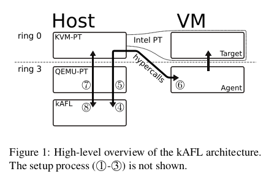
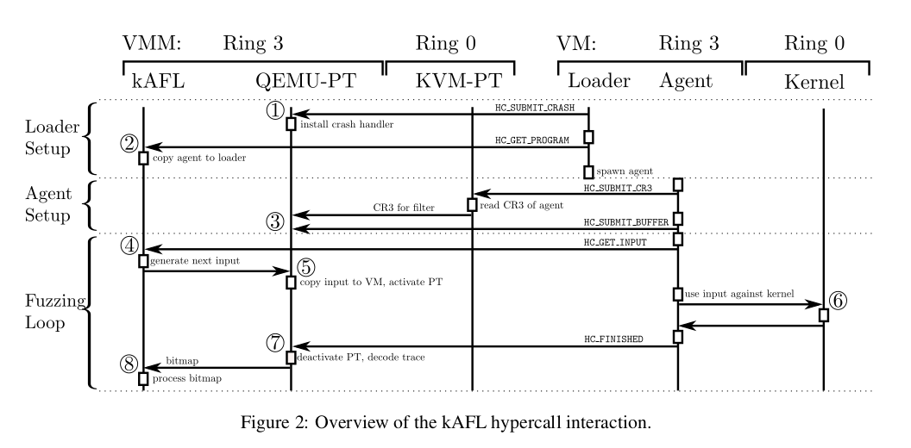
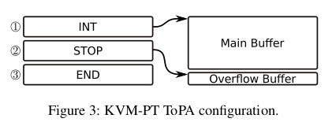
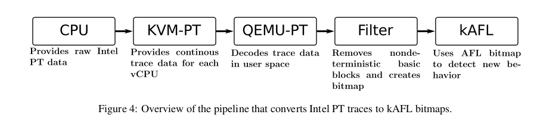
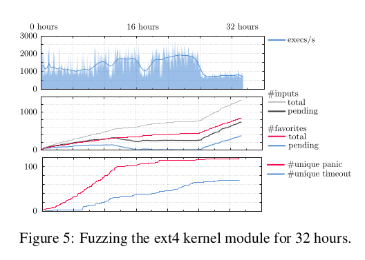

## **Abstract**

Develop a framework -- **kernel-AFL** for Linux, MacOS, Windows fuzzing in **kernel space**

Find some flaws in FS of these three kernels

## 1 Introduction

Existing framework for fuzz: AFL, OSS Fuzz

Current framework's problem: 

- Aim for **User Space**
- Not portable

Challenges in fuzzing in kernel space: 

- Usage of **virtualization**
- More **non-determined**(interrupt, thread, statefulness)
- **Difficult to interact** with kernel space
- *Windows and MacOS is close source(except Linux)

kernel-AFL Development and contribution:

OS independence: almost OS-independent manner using harnessing the hypervisor

Hardware-assisted feedback: use Processor Trace technology, less performance overhead. Develop a PT decoder faster than Intel's decoder.

Extensible and modular design:  separates fuzzer, tracing engine and target, suppose more additional components. 

**Open source**

## 2 Technical Background

pass

## 3 System Overview

Three components: fuzzing logic, VM infrastructure(QEMU-PT & KVM-pt), user mode agent 



1. the loader(part of user agent) use hypercall `HC_SUBMIT_PANIC `to submit the address of kernel panic handler to QEMU-PT, allowing to **get crash immediately**(not until reboot or shut down)
1. the loader use `HC_GET_PROGRAM` to request actual user mode agent and starts it
1. fuzzer initialization: the agent use `HC_SUBMIT_CR3` get the CR3's value, submit it to QEMU-PT to filter. And agent use `HC_SUBMIT_BUFFER` tell address it expects its inputs. main loop started
1. the agent requests a new input using the `HC_GET_INPUT`
1. The fuzzing **logic produces a new input** and sends it to QEMU-PT.  QEMU-PT(full access to VM's memory) **copy the input into the buffer** specified by the agent. Then it performs a VM-Entry to continue executing the VM
1. At the same time, it enable the PT tracing. The agent now consumes the input and interacts with the kernel
1. While fuzzing, QEMU-PT decoder trace data and update bitmap. Once interact finish and agent get control from kernel, agent call `HC_FINISHED` resulting VM-Exit stops the tracing and QEMU-PT decodes the remaining trace data 
1. bitmap pass to the kAFL



### 3.1 Fuzzing Logic

Based on the **algorithms used by AFL**

Use **bitmap** to store basic block transitions

kAFL use multiprocessing and parallelism

While AFL simply spawns mul- tiple independent fuzzers which synchronize their input queues sporadically. kAFL **executes the deterministic stage in parallel**, and **all threads work on the most interesting input**. A significant amount of time is spent in tasks that are not CPU-bound (?)

> Not *so* understand.

### 3.2 User Mode Agent

Two parts:

Loader: **accept an arbitrary binary** via the hypercall interface and **check if the agent has crashed** 

user mode agent: represented by binary and synchronize and **gather new inputs** by the fuzzing logic via the hypercall interface and use it to **interact with the guest’s kernel.**

### 3.3 Virtualization Infrastructure

KVM-PT: KVM-PT allows us to **trace individual vCPUs** instead of logical CPUs. it configures and enables Intel PT on the respective logical CPU before the CPU switches to guest ex- ecution and disables tracing during the VM-Exit transition. The associated CPU will **only provide trace data of the virtualized kernel itself**

QEMU-PT: **configure and toggle Intel PT** from user space and access the output buffer to **decode the trace data.** also **filters the stream of executed addresses**—based on previous knowledge of non-deterministic basic blocks—to prevent false-positive fuzzing results

### 3.4 Stateful and Non-Deterministic Code

Two way to deal with Non-Deterministic in kernel

- **filter interrupt and switch during it**, using Intel PT. Decoder will discard TIP and FUP until meet `iret`
- **blacklist any basic block that occurs non-deterministically**. re-run the input several times in a row. Every basic block that does not show up in all of the trials will be marked as non-deterministic and filtered from further processing. 

### 3.5 Hypercalls

They patched KVM-PT to pass through their own set of hypercalls to the fuzzing logic if a magic value is passed in `rax` and the appropriate hypercall-ID is set in `rbx`. also patched KVM-PT to accept hyper- calls from ring 3 Arguments for specific hypercalls are passed through `rcx`. (?) 

> What's Magic Value for?

```assembly
cli #disable interrupt
mov rax , KAFL_MAGIC_VALUE
mov rbx , HC_CRASH
mov rcx , 0 x0
vmcall
```

## 4 Implementation Details

### 4.1 KVM-PT

#### 4.1.1 vCPU Specific Traces

Issue: Enable Intel PT need to set the corresponding bit of a MSR and switch context to VM(running by logic CPU including data we do not need) also this will happen opposite in disable

Solution: use the **MSR autoload capabilities of Intel VT-x**. MSR autoloading can be enabled by modifying the corresponding entries in the VMCS . This forces the CPU to load a list of preconfigured values for defined MSRs after either a VM- entry or VM-exit has occurred.

#### 4.1.2 Continuous Tracing

Issue: While the buffer of tracing data is full, CPU deal with it through:

- continue execute with out tracing, cause incomplete traces
- raise an interrupt causing VM-exit

Solution: use two different **ToPA entries**. The first one is the main buffer . Its overflow behavior is to **trigger the interrupt**.  Then a second entry is used until the interrupt is actually delivered. Overflowing the second buffer(four times larger than the largest overflowing trace have ever seen in tests (4 KB)) would lead to the **stop of the tracing**

In case the second buffer also overflows, the following trace will contain a packet indicating that some data is missing. then we can increase the buffer long(?)

> I do not understand why design two buffer. Can not totally avoid overflow



### 4.2 QEMU-PT

QEMU-PT's effort:

- Fully supply for KVM-PT
- Decoder for trace data -Intel PT datapacket to bitmap



#### 4.2.1 PT Decoder

Issue: kernel fuzzing may generate huge number of trace data per second, and decode depends on former decode result, we need **effective and precise decoder**

Intel's effort: **libipt**, but not fit(decode for providing execution data(we dont need) and flow information. Also does not cache disassembled instructions)

Solution: We only need flow information and fuzzing is repeatedly running on the same code.

- code sections are **only considered if they are executed** according to the decoded trace data
- all disassembled code sections are cached
- ignore packets that are not relevant for our use case
- decoding running on buffer, not need to store

### 4.3 AFL Fuzzing Logic

AFL basic block transition offset formula(hash map):

$$ (id(A)/2 ⊕ id(B)) \% SIZE\_OF\_BITMAP $$

- kAFL use **address** instead of random number for basic block
- While finishing fuzzing, compare bitmap with the global static bitmap. If a new bit was found, it is added to the global bitmap and the input that triggered the new bit is added to the queue. 
- When a new interesting input is found, a deterministic stage is executed that tries to **mutate each byte individually**.
- Once the deterministic stage is finished, the non- deterministic phase is started. **multiple mutations are performed at random locations.** 

## 5 Evaluation

Running on Windows, LInux and MacOS. We focus on Linux

obtained significantly better coverage and managed to discover 160 unique crashes and multiple (confirmed) bugs in the ext4 driver during a twelve-day fuzzing campaign.



Detected Vulnerabilities:

- Linux: keyctl Null Pointer Dereference(CVE-2016-8650)
- Linux: ext4 Memory Corruption
- Linux: ext4 Error Handling
