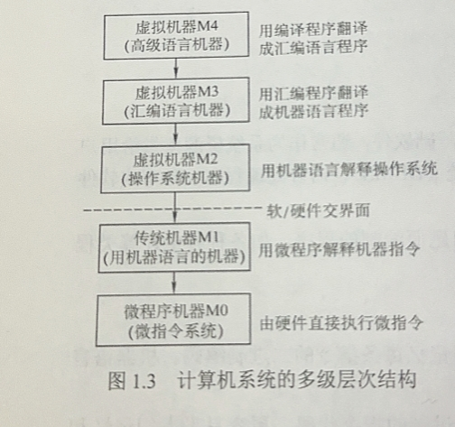
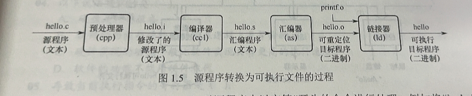

## 1.1 计算机发展历程

pass

## 1.2 计算机系统层次结构

### 1.2.1 计算机系统组成

pass

### 1.2.2 计算机硬件

####  冯诺依曼机

（1）存储程序

（2）Organization: 运算器、存储器、控制器、输入设备、输出设备

（3）指令和数据同等存储在存储器

（4）2进制表示

#### 功能部件

（1）输入设备

pass

（2）输出设备

pass

（3）存储器

**主存（内存）**：CPU直接访问，按地址存取，地址寄存器（MAR）存放地址，数据寄存器（MDR）存放读写数据

MAR-10 Addr-$2^{10}=1k$ 

（4）运算器

**运算器不等价于ALU**

算数逻辑单元CALU

计算用寄存器：累加器（ACC），乘商寄存器（MQ），操作数寄存器（X）

状态寄存器（PSW）

（5）控制器

Organization: 程序寄存器（PC），指令寄存器（IR），控制单元（CU）

### 1.2.3 计算机软件

#### 系统软件和应用软件

系统软件：OS，DBMS，语言处理程序（编译器，解释器，汇编器），分布式软件系统，网络软件系统，标准库，服务程序

#### 语言

pass

#### 软件硬件逻辑功能等价性

某一功能可以由硬件和软件等价实现，硬件性能一般大于软件

### 1.2.4 计算机系统的层次结构

裸机：没有软件的纯硬件系统

3-5层被称为虚拟机

指令集体系结构（ISA）定义一台计算机可以执行的所有指令的集合

### 1.2.5 计算机系统工作原理

#### 存储程序工作方式

程序执行前将所有指令和数据送入主存，程序启动后自动逐条完成指令的取出和执行

#### 源程序到可执行程序

（1）预处理：处理#开头命令，插入头文件内容

（2）编译：c->asm .c->.s

（3）汇编：asm->machine .s->.o

（4）链接：将.h中所调用的函数定义的.o文件合并，生成可执行文件

#### 程序执行过程

pass

#### 指令执行过程

（1）取指令：PC->MAR->M->MDR->IR

根据PC将指令取到IR，MAR同时根据PC内容送出Addr，CU送读写信号，主存读出对应Addr的Data存入MDR，写入IR

（2）分析指令：IR（OP）->CU

控制器根据IR指令操作码

（3）执行指令：IR（AD）->MAR->M->MDR->ALU

IR中地址送入MAR，主存将Data存入MDR，送入ALU计算

## 错误整理

冯诺依曼机驱动方式：数据流驱动

CPU存取速度：寄存器>缓存>内存

地址空间：$2^{MAR}$

系列机的基本特性是指令系统向后兼容

CPU组成不包括存储器

数据库系统不是系统软件，DBMS才是

计算机系统层次结构上下层是可以分割的

解释器不产生目标程序

冯诺伊曼区分指令和数据的依据是指令周期的不同阶段