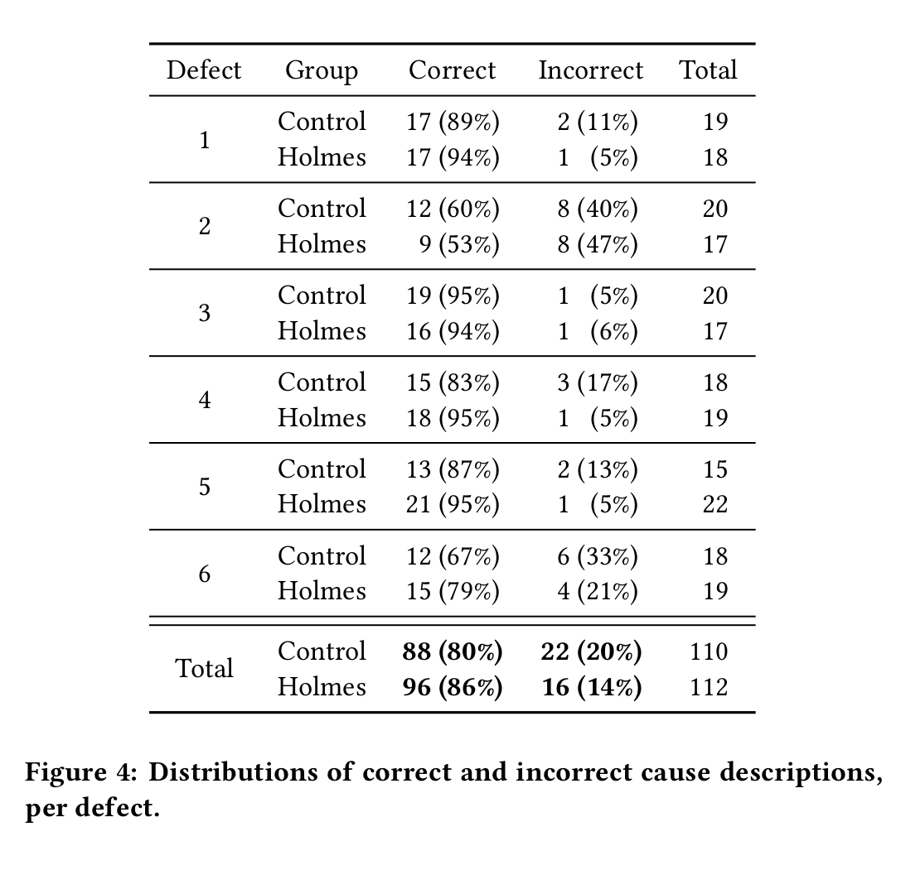
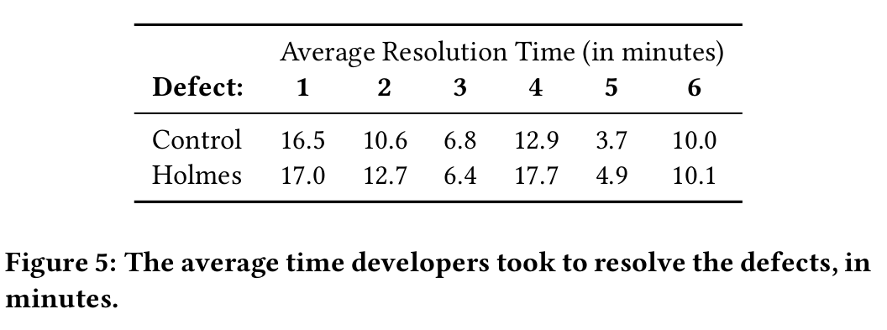
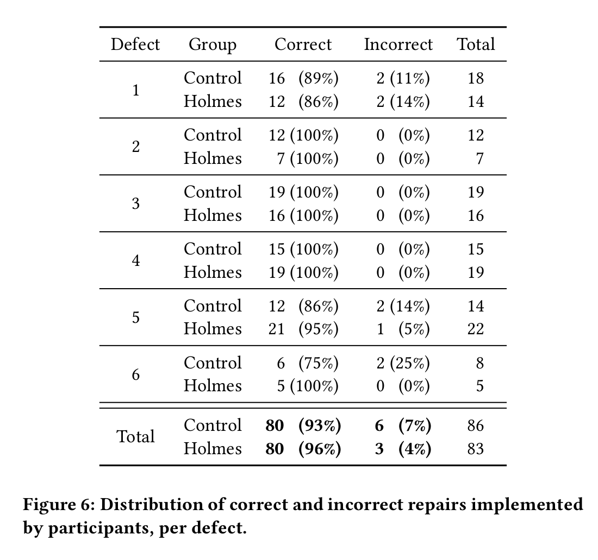
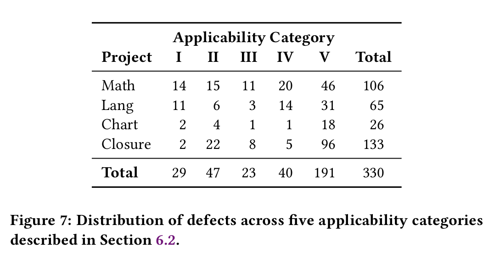

## 1 Introduction

Traditional Debugger: finding the relevant line, minimize the failing input

Need a method to find **root cause** of fault

**Causal Testing**: based on the theory of counterfactual causality

> counterfactual causality: a theory of causation that proposes if event A did not occur, then event B would not have occurred either. In other  words, if the occurrence of event A is altered (even though this didn't  actually happen in reality, hence "counterfactual"), then the outcome of event B would change. This is the basic concept of counterfactual  causality.

Given one or more failing executions, Causal Testing conducts **causal experiments** by minimally change input test that don't cause faulty behavior

To find: **input change -> behavior change**(called causal change in article)

And try to **minimize** this change(from input or execution path)

## 2 Motivating Example

### 2.1 Direction Error in GIS

In GIS, find a error in direction between "New York, NY, USA" and "900 René
Lévesque Blvd. W Montreal, QC, Canada"

There a many possible cause of this error, difficult to find the real one.

Use Causal Testing like:

All the failing test cases have one address in **Different Country**

### 2.2 Error of Create Hex in Apache

Exception occur when create hex 0Xfade(valid hex)

Causal Test find that 0xfade pass but 0Xfade fail(static)

And trace the difference in execution at line 458(dynamic)

For this test, Causal Test may try: 0XFADE , 0xfade , edafX , 0Xfad , Xfade , fade, etc...

## 3 Causal Testing

### 3.1 Causal Experiments with Test Cases

For 2.2's example, process is:

#### 3.1.1 Perturbing Test Inputs

Use **fuzzer** to fuzz all the existing tests and generate many tests

**Compare** generated test with original failing test

Filter those **similar** to original failing test

#### 3.1.2 Input Similarity

What's **Similar Test**?

Only differ in one **factor**(syntactic differences and execution path differences)

**Syntactic Differences** (also called Static Input Differences in paper):

1. Parameters of function
2. Type of Parameters
3. etc...(like numerical difference or ratio, string's Levenshtein distance)

Different factor have different importance in different situation

**Execution Path Differences**:

Focus on execution pass, needed to find which only differ **in few methods calling or statement** but lead to completely different result(pass and fail)

### 3.2 Communicating Root Causes to Developers

For each pair of **pass and fail** similar input, collects the **input** and **the execution traces** for each test it executes with differences highlighted

## 4 Holmes: A Causal Testing Prototype

### 4.1 Input & Test Case Generation

1. We have **current test suite**
2. Search all the current test suite to find **similar test** of original failing test. Create a string of input file, measure its approximation of similarity
3. Generate new tests: two ways
   - Test case generation: test case generation tool, **EvoSuite**. Generate test calling same method in same **class**(NumberUtilsTest -> NumberUtils)
   - Input fuzzing: fuzzer **Peach and Fuzzer**. fuzz origin test and generated test to get valid input

> Only complete Syntactic Differences measure. Execution Path Differences need to update

> Class there is OOP's class according to paper

### 4.2 Test Execution & Edit Distance Calculation

1. Determine **data type** of parameters to decide how to calculate distance
2. Different data type use different ways of calculation
   - Numerical: calculates the absolute value of the arithmetic difference
   - String: determines the Hamming distance and Levenshtein distance
3. Find test satisfy original failing test's oracle, then **further minimize** the test differences: for each original parameters(mean test which we find efficient), **iteratively replacing** the value with new input value.
4. Try to **find three similar passing tests** to compare to the failing one

origin failing test -> more similar failing test -> 3 similar passing test

> Hamming distance:  defined as the number of positions at which the corresponding symbols are different in the two strings. 

> Levenshtein distance: defined as the minimum number of single-character edits (insertions,  deletions, or substitutions) required to transform one string into the other

### 4.3 Communicating Root Causes to Developers

Following will be showed:

- Original failing test
- Similar passing test
- similar failing test
- Execution Trace(may be stack)

### 4.4 Holmes' Limitation

- Need to **manually** match test and trace
- For a test only support single parameter

## 5 Causal Testing Effectiveness

Three needs to know:

- If is helpful to find root cause of defect
- If is helpful to fix root cause of defect
- If useful to user

### 5.1 User Study Design

7 defects from *Apache Commons Lang project*

4 task use Holmes, 3 without

Participant need to find and fix all the defects and answer some question about this task and feedback.

### 5.2 Participants

39 people from industry and academia

### 5.3 User Study Findings

- If is helpful to find root cause of defect

  

- If is helpful to fix root cause of defect

  

  

- If useful to user

Causal Testing is useful for both cause identification and defect resolution, and is complementary to other debugging tools.

> do not read this part carefully QAQ(too long)

Updating suggestion

- add the ability to click on the output and jump to the related code in the IDE
- between the passing and failing tests visibly more explicit
- bolding the parts that are different from the original failing test

## 6 Causal Testing Applicability to Real-world Defects

330 defects used for test

### 6.1 Evaluation Process

Use Two version of code: **buggy and fixed**

Run Holmes to find target failing test

Use fixed version to check if Holmes find the root cause

Evaluate the result to categorize defects

### 6.2 Defect Applicability Categories

Categorize defects into 5 categories

- Works, useful, and fast
- Works, useful, but slow(difference between test is large)
- Works, but is not useful(useless to find root cause)
- Will not work(find no result for pass and fail)
- Could not make a determination(need project-specific domain knowledge to understand)

### 6.3 Results 

## 7 My Opinion and Thought

### 7.1 Pros and Cons

**Pros**:

- Simply explain this paper's work is: **Use fuzz for debug**. This is a quite interesting idea. And I think this may work for many issue.
- Giving a idea on how to compare input similarity of function input.
- Giving a idea on how to minimize inputs' differences
- Mostly importantly, give me a idea on how to **make fuzz more efficient**: by compare two input of finally different behaviors

Cons:

- Mostly apparently, Evaluation shows that this method used for debugging may not so make help.
- I think the  evaluation scale is a little bit small
- And for user, it may need sometime for them to **familiar to this tool**
- I think the **trace compare** for test is quite important. Its a pity that author not accomplish it.
- I think just string compare is too simple. There are more possible input thing to think: pointer, class, function, etc...
- updating...

### 7.2 My Application

Maybe can use for kernel fuzz. For making fuzz's input generating more efficient. And may help us to find defects' cause and fixing method.
