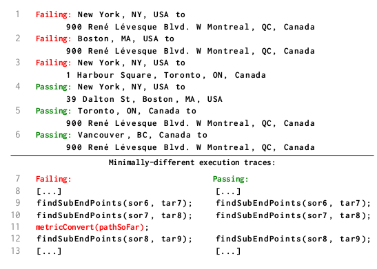
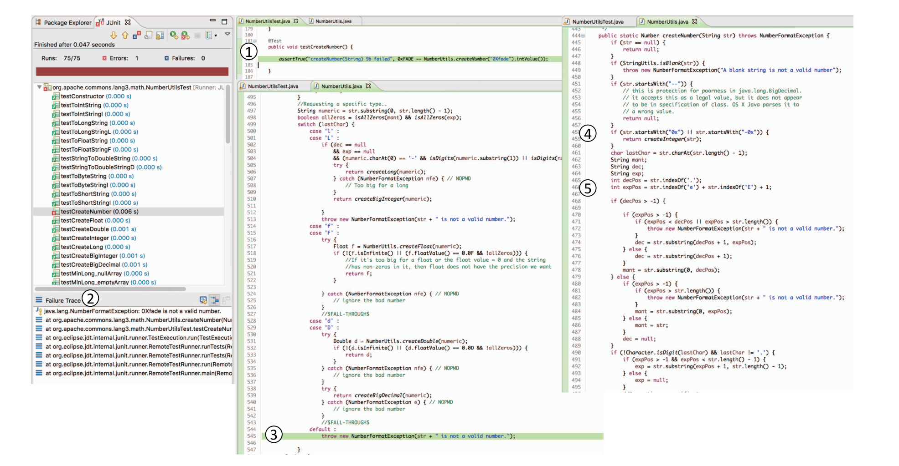
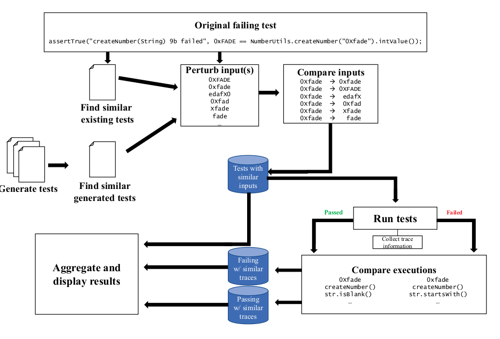

## 1 Introduction

Traditional Debugger: finding the relevant line, minimize the failing input

Need a method to find **root cause** of fault

**Causal Testing**: based on the theory of counterfactual causality

> counterfactual causality: a theory of causation that proposes if event A did not occur, then event B would not have occurred either. In other  words, if the occurrence of event A is altered (even though this didn't  actually happen in reality, hence "counterfactual"), then the outcome of event B would change. This is the basic concept of counterfactual  causality.

Given one or more failing executions, Causal Testing conducts **causal experiments** by minimally change input test that don't cause faulty behavior

To find: **input change -> behavior change**(called causal change in article)

And try to **minimize** this change(from input or execution path)

## 2 Motivating Example

### 2.1 Direction Error in GIS

In GIS, find a error in direction between "New York, NY, USA" and "900 René
Lévesque Blvd. W Montreal, QC, Canada"

There a many possible cause of this error, difficult to find the real one.

Use Causal Testing like:

All the failing test cases have one address in **Different Country**

### 2.2 Error of Create Hex in Apache

Exception occur when create hex 0Xfade(valid hex)

Causal Test find that 0xfade pass but 0Xfade fail(static)

And trace the difference in execution at line 458(dynamic)

For this test, Causal Test may try: 0XFADE , 0xfade , edafX , 0Xfad , Xfade , fade, etc...

## 3 Causal Testing

### 3.1 Causal Experiments with Test Cases

For 2.2's example, process is:

#### 3.1.1 Perturbing Test Inputs

Use **fuzzer** to fuzz all the existing tests and generate many tests

**Compare** generated test with original failing test

Filter those **similar** to original failing test

#### 3.1.2 Input Similarity

What's **Similar Test**?

Only differ in one **factor**(syntactic differences and execution path differences)

**Syntactic Differences** (also called Static Input Differences in paper):

1. Parameters of function
2. Type of Parameters
3. etc...(like numerical difference or ratio, string's Levenshtein distance)

Different factor have different importance in different situation

**Execution Path Differences**:

Focus on execution pass, needed to find which only differ **in few methods calling or statement** but lead to completely different result(pass and fail)

### 3.2 Communicating Root Causes to Developers

For each pair of **pass and fail** similar input, collects the **input** and **the execution traces** for each test it executes with differences highlighted

updating

