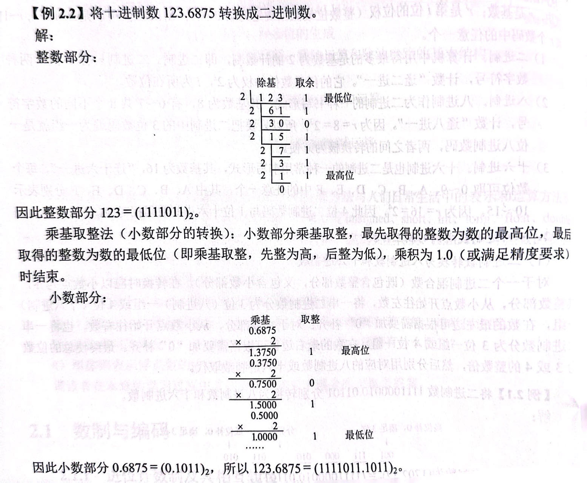

## 2.1 数制与编码

### 2.1.1 进位计数制及其相互转换

#### 数的表示

r进制数（$K_nK_{n-1}...K_0K_{-1}...K_{-m}$）的表示

$$K_nr^n+K_{n-1}r^{n-1}+...+K_0r^0+K_{-1}r^{-1}+...+K_{-m}r^{-m}$$

#### **※不同进制之间的相互转换**

（1）2->8，16

二转八每三位看成一个数，二转十六每四位看成一个数

在小数点处分界，整数部分不为3(4)的倍数左侧补齐，小数部分不为3(4)的倍数右侧补齐

（2）转10进制

各位数码与其权值相乘，然后求和

（3）10->2,8,16

基数乘除法

#### 真值和机器数

机器数1表示- 0表示+

### 2.1.2 BCD

pass

### 2.1.3 定点数的编码表示

现代计算机中用定点补码整数表示整数

用定点原码小数表示浮点数的位数部分

用移码表示浮点数的阶码部分

#### 机器数的定点表示

定点小数约定小数点位于第几位，定点整数小数点在数字最后

符号位在最高位

#### ※原码、反码、补码、移码

updating