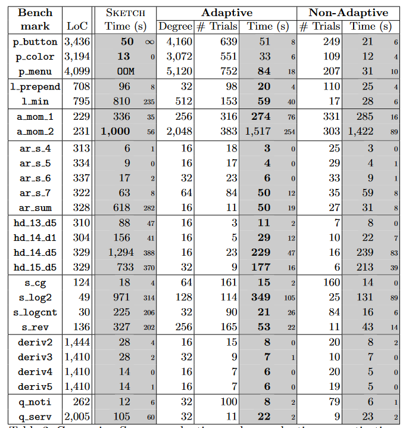

## Task

Improve program synthesis

Further, improve solving $∃c.∀x.Q(x, c)$ where x is input bit-vector and c is a control bit-vector

## Current Method

**explicit search**: either stochastically or systematically enumerating the candidate program space

**symbolic search**: encoding the search space as constraints that are solved using a SAT solver

for solving $∃c.∀x.Q(x, c)$ paper mentioned Sketch(Use CEGIS to solve), which totally work by **symbolic search**

### Disadvantages

1.  while symbolic methods can efficiently solve for some unknowns, others cause synthesis time to grow dramatically.

## Methods

“adaptive concretization”

combines many of the benefits of explicit and symbolic search while also parallelizing

key idea: **use** **explicit search to guess(concretize) some highly influential unknowns then use symbolic search by CEGIS to solve**

### Unknown Influences

for node in tree

$influence(n) = ∑ _{d∈children(n)} benefit(d, n)$

where $children(n)$  is the set of all nodes that depend directly on n,  node n is the parent of node d

for $benefit(d, n)$, like following

notice: $benefit(d, n)$ is a **approximation algorithm**

### Degree of Concretization

“threshold for concretization”

For each unknown n in the constraint graph,  calculate its estimated influence N = influence(n). Then concretize the node with probability”

but **the optimal degree varies across all benchmarks**

### Adaptive, Parallel Concretization

use climb, bin search and wilcoxon to estimate best degree

Parallelization: **run trial function**

## Experiment

1.  Evaluated adaptive concretization against a range of benchmarks(http\://plum-umd.github.io/adaptive-concretization) with various characteristics compared to regular Sketch

    

    faster in many cases

2.  compared adaptive concretization with concretization fixed at the final degree chosen by the adaption phase of algorithm

    performance is reasonably close, meaning the overhead for adaptation is not high

3.  measured parallel scalability of adaptive concretization of 1, 4, and 32 cores

    

    it generally scales well

## Related Work

1.  use Markov Chain Montecarlo (MCMC) techniques
2.  Another alternative to constraint-based synthesis is explicit enumeration of candidate solutions
3.  use symbolic reasoning to improve sampling-based procedures
4.  combine a portfolio approach(solvers are run in parallel with different heuristics) with clause sharing
5.  loses the ability to tell if a problem is UNSAT because we cannot distinguish not finding a solution from having made incorrect guesses during concretization.
